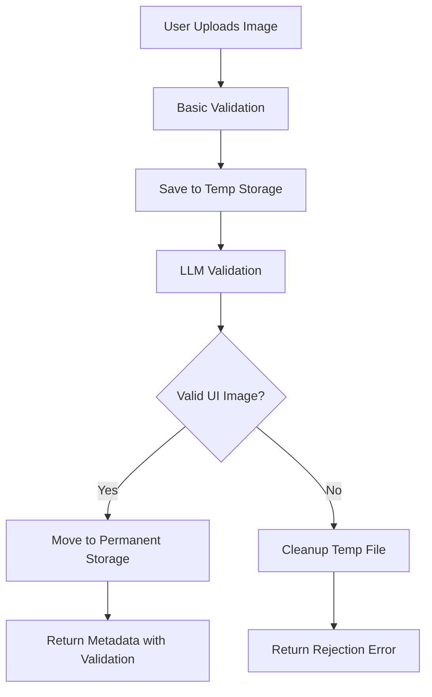

# Enhanced Upload Service Implementation Summary

## Overview

This document summarizes the implementation of **Enhanced Upload Flow 1.2** with LLM validation as specified in `architecture/DATAFLOW.md`. The implementation adds intelligent image validation using OpenAI GPT-4V to ensure only valid UI screenshots are accepted for annotation.

## 🎯 What Was Implemented

### 1. **New Data Models** (`models/validation_models.py`)
- `ValidationResult` - Complete LLM validation result with confidence scores
- `ValidationStatus` - Enum for validation states (VALID, INVALID, PENDING, ERROR)
- `UIValidationRequest` - Request parameters for custom validation
- `TemporaryFileInfo` - Metadata for temporary file management
- `ValidationConfig` - Configuration for LLM validation settings

### 2. **LLM Validation Service** (`services/ui_validation_service.py`)
- `UIImageValidationService` - Core service for validating UI images using LLM
- **Key Features:**
  - Image resizing for cost optimization (max 1024px)
  - Caching validation results by image hash
  - Configurable confidence thresholds
  - Timeout handling and error fallbacks
  - Detailed prompt engineering for UI detection

### 3. **Enhanced File Storage** (`utils/file_storage.py`)
- **New Methods:**
  - `save_temporary_file()` - Save uploads to temp storage
  - `move_temp_to_permanent()` - Move validated files to permanent storage
  - `cleanup_temporary_file()` - Clean up rejected/expired files
  - `save_validated_image()` - Complete validated image save workflow
  - `cleanup_expired_temp_files()` - Automated cleanup

### 4. **Configuration Management** (`utils/config.py`)
- `AppConfig` - Comprehensive configuration with environment variables
- `ConfigManager` - Singleton pattern for config management
- **Environment Variables:**
  ```bash
  OPENAI_API_KEY=your_key_here
  LLM_VALIDATION_ENABLED=true
  LLM_VALIDATION_CONFIDENCE_THRESHOLD=0.7
  LLM_VALIDATION_TIMEOUT=10
  LLM_VALIDATION_FALLBACK_ON_ERROR=true
  # ... and more
  ```

### 5. **Enhanced Upload Service** (`services/enhanced_upload_service.py`)
- `EnhancedUploadService` - Orchestrates the complete upload flow
- **Upload Flow:**
  1. ✅ Basic file validation (type, size)
  2. 💾 Save to temporary storage
  3. 🤖 LLM validation using GPT-4V
  4. ✅ Move to permanent storage OR ❌ cleanup and reject
- Background cleanup tasks for expired temp files

### 6. **FastAPI Integration** (`adapters/enhanced_fastapi_adapter.py`)
- Complete FastAPI application with new endpoints
- **New Endpoints:**
  - `POST /images/upload` - Standard LLM-validated upload
  - `POST /images/upload-custom` - Upload with custom validation parameters
  - `GET /stats/validation` - Validation and storage statistics
  - `POST /admin/cleanup-temp-files` - Manual temp file cleanup
  - `POST /admin/clear-validation-cache` - Clear validation cache

### 7. **Updated Data Models** (`models/annotation_models.py`)
- Enhanced `ImageMetadata` with `llm_validation_result` field
- Type-safe forward references for validation results

## 🔄 Enhanced Upload Flow (1.2)



## 🛠️ Key Features Implemented

### **Intelligent Validation**
- Uses GPT-4V to analyze image content
- Detects UI elements: buttons, inputs, forms, menus
- Rejects non-UI content: photos, documents, diagrams
- Configurable confidence thresholds

### **Performance Optimizations**
- **Image Resizing**: Automatically resize large images before LLM processing
- **Caching**: Cache validation results by image hash to avoid duplicate calls
- **Timeouts**: Configurable timeouts prevent hanging requests
- **Background Cleanup**: Automatic cleanup of expired temporary files

### **Error Handling & Fallbacks**
- **Graceful Degradation**: Can fallback to allow uploads if LLM fails
- **Detailed Error Messages**: Clear feedback on why images are rejected
- **Comprehensive Logging**: Full audit trail of validation decisions

### **Cost Management**
- **Image Compression**: Reduce API costs by optimizing image size
- **Result Caching**: Avoid duplicate LLM calls for identical images
- **Timeout Controls**: Prevent expensive hanging requests

## 📋 Environment Setup

1. **Install Dependencies** (already in `requirements.txt`):
   ```bash
   pip install -r requirements.txt
   ```

2. **Configure Environment** (create `.env` file):
   ```bash
   OPENAI_API_KEY=your_openai_api_key_here
   LLM_VALIDATION_ENABLED=true
   LLM_VALIDATION_CONFIDENCE_THRESHOLD=0.7
   DATA_DIRECTORY=data
   ```

3. **Run the Enhanced Service**:
   ```bash
   python adapters/enhanced_fastapi_adapter.py
   ```

## 🔗 Integration Points

### **With Existing Services**
- ✅ Extends existing `LLMUIDetectionService`
- ✅ Enhances existing `FileStorageManager`
- ✅ Compatible with existing `ImageMetadata` model
- ✅ Maintains backward compatibility

### **API Changes**
- **New**: `POST /images/upload` with LLM validation
- **New**: Custom validation parameters support
- **Enhanced**: Metadata now includes validation results
- **Added**: Admin endpoints for cache and cleanup management

## 📊 Monitoring & Statistics

The service provides comprehensive statistics:

```json
{
  "validation_cache": {
    "cache_size": 150,
    "cache_enabled": true
  },
  "temp_files": {
    "total_temp_files": 3,
    "expired_temp_files": 1,
    "total_temp_size_mb": 12.5
  },
  "storage": {
    "total_images": 1250,
    "total_storage_mb": 2847.3
  }
}
```

## 🚀 Usage Examples

### **Basic Upload with Validation**
```python
# Upload will be automatically validated by LLM
response = await client.post(
    "/images/upload",
    files={"file": ("screenshot.png", file_content, "image/png")}
)
```

### **Custom Validation Parameters**
```python
# Upload with custom confidence threshold
response = await client.post(
    "/images/upload-custom",
    files={"file": ("ui.png", file_content, "image/png")},
    data={
        "confidence_threshold": 0.8,
        "timeout_seconds": 15,
        "include_element_detection": True
    }
)
```

## ✅ Validation Criteria

The LLM validates images based on:

### **✅ ACCEPTS**
- Web interface screenshots
- Mobile app screens
- Desktop application UIs
- Interactive elements: buttons, forms, menus
- Navigation and control interfaces

### **❌ REJECTS**
- Photos of people, objects, landscapes
- Documents, PDFs, text-only content
- Drawings, illustrations, diagrams
- Code editors (unless clear UI chrome)
- Random screenshots without UI elements

## 🔮 Future Enhancements

This implementation provides the foundation for:
- **Batch Validation**: Process multiple images simultaneously
- **Custom Models**: Train specialized UI detection models
- **Advanced Analytics**: Detailed UI element classification
- **Quality Scoring**: Rate UI design quality and accessibility
- **Integration**: Connect with annotation and labeling workflows

---

**Status**: ✅ **COMPLETE** - Ready for testing and deployment

The enhanced upload service with LLM validation is fully implemented and ready to replace the basic upload flow (1.1) with intelligent content filtering. 