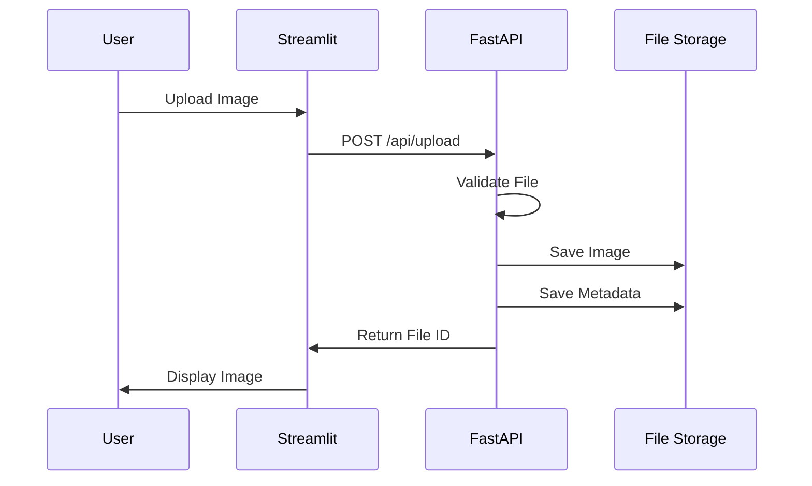
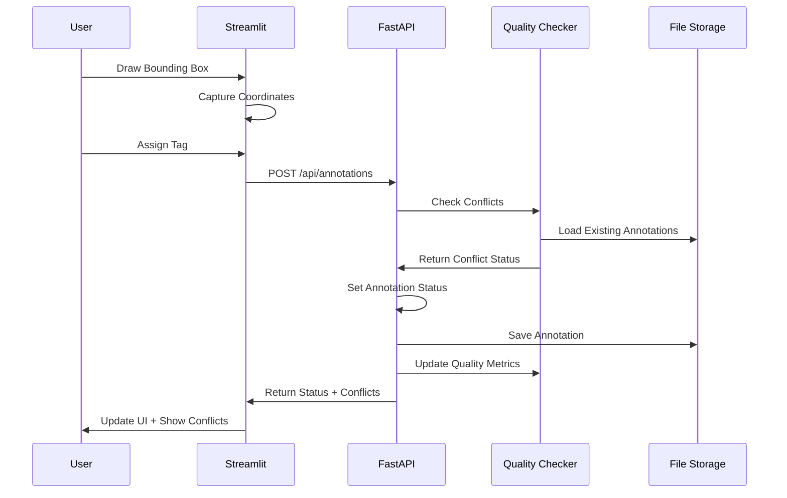
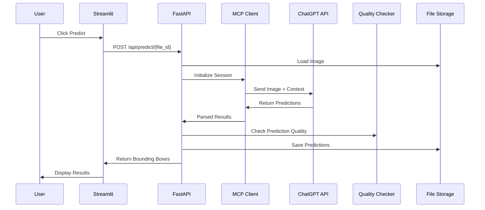
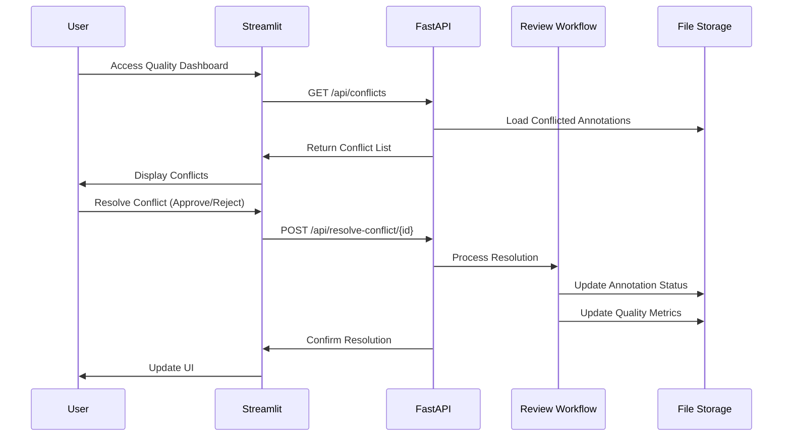
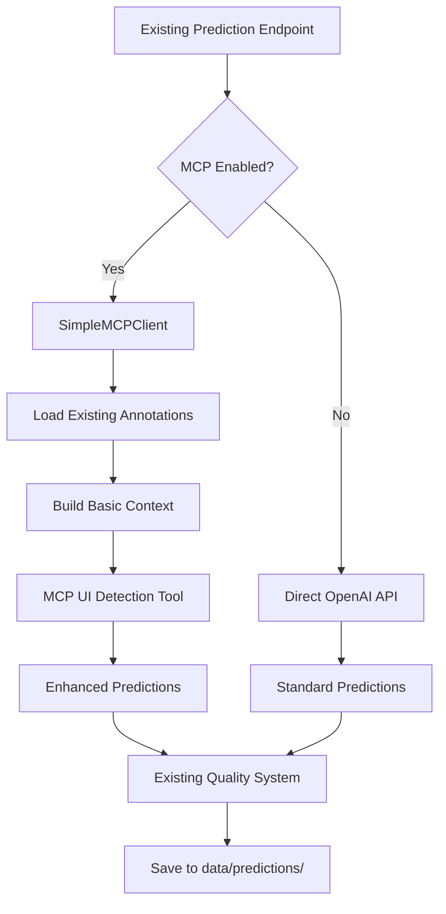

# System Architecture Documentation

## Table of Contents

1. [System Overview](#system-overview)
2. [Technology Stack Decisions](#technology-stack-decisions)
3. [Architecture Patterns](#architecture-patterns)
4. [Data Flow Design](#data-flow-design)
5. [Ground Truth Management](#ground-truth-management)
6. [MCP Integration Architecture](#mcp-integration-architecture)
7. [API Design Principles](#api-design-principles)
8. [Data Storage Strategy](#data-storage-strategy)
9. [Performance Considerations](#performance-considerations)
10. [Security Architecture](#security-architecture)
11. [Error Handling & Resilience](#error-handling--resilience)
12. [Scalability Design](#scalability-design)
13. [Development & Deployment](#development--deployment)
14. [Future Considerations](#future-considerations)

## Related Documents

**Specialized Architecture Documents:**
- **[MCP_ARCHITECTURE.md](./MCP_ARCHITECTURE.md)** - Model Context Protocol integration strategy and implementation
- **[IMPLEMENTATION_PLAN.md](./IMPLEMENTATION_PLAN.md)** - Development roadmap and phases
- **[DATAFLOW.md](./DATAFLOW.md)** - System data flows and processing
- **[DATA_TYPES.md](./DATA_TYPES.md)** - Comprehensive data model specifications

## System Overview

### High-Level Architecture

```
┌─────────────────────────────────────────────────────────────────┐
│                        Client Layer                            │
├─────────────────────────────────────────────────────────────────┤
│  Streamlit Frontend (Port 8501)                               │
│  ├── Image Upload & Display                                   │
│  ├── Interactive Annotation Interface                         │
│  ├── LLM Prediction Results Viewer                           │
│  ├── Quality Dashboard                                       │
│  ├── Conflict Resolution Interface                           │
│  └── Batch Processing Dashboard                              │
└─────────────────────────────────────────────────────────────────┘
                                 │
                                 │ HTTP/WebSocket
                                 ▼
┌─────────────────────────────────────────────────────────────────┐
│                     Application Layer                          │
├─────────────────────────────────────────────────────────────────┤
│  FastAPI Backend (Port 8000)                                  │
│  ├── RESTful API Endpoints                                    │
│  ├── WebSocket for Real-time Updates                         │
│  ├── Background Task Processing                              │
│  ├── Ground Truth Quality Checker                            │
│  ├── Annotation Conflict Detection                           │
│  ├── Review Workflow Management                              │
│  └── File Upload & Validation                                │
└─────────────────────────────────────────────────────────────────┘
                                 │
                                 │ MCP Protocol
                                 ▼
┌─────────────────────────────────────────────────────────────────┐
│                     LLM Integration Layer                      │
├─────────────────────────────────────────────────────────────────┤
│  Model Context Protocol (MCP) Client                          │
│  ├── Structured Context Management                           │
│  ├── Tool-based UI Detection                                 │
│  ├── Response Validation & Parsing                           │
│  └── Session State Management                                │
└─────────────────────────────────────────────────────────────────┘
                                 │
                                 │ HTTPS
                                 ▼
┌─────────────────────────────────────────────────────────────────┐
│                     External Services                          │
├─────────────────────────────────────────────────────────────────┤
│  OpenAI ChatGPT-4V API                                        │
│  └── Vision-based UI Element Detection                        │
└─────────────────────────────────────────────────────────────────┘
```

### Component Responsibilities

| Component                        | Primary Responsibilities                                     | Secondary Responsibilities                              |
| -------------------------------- | ------------------------------------------------------------ | ------------------------------------------------------- |
| **Streamlit Frontend**           | User interface, image display, annotation tools              | Real-time feedback, batch monitoring, quality dashboard |
| **FastAPI Backend**              | API orchestration, file management, validation               | Background processing, WebSocket management             |
| **Ground Truth Quality Checker** | Conflict detection, agreement calculation, status management | Quality metrics, validation                             |
| **Review Workflow Manager**      | Conflict resolution, approval workflows                      | Consensus building, status updates                      |
| **MCP Client**                   | LLM communication, context management, tool execution        | Response parsing, error handling                        |
| **Enhanced Storage**             | File persistence, data consistency, organized structure      | Backup, recovery, quality tracking                      |

## Technology Stack Decisions

### Frontend: Streamlit

**Decision Rationale:**
- **Rapid Prototyping**: Fast development for ML/AI applications
- **Built-in Components**: Native support for file uploads, image display
- **Interactive Widgets**: Easy implementation of annotation tools
- **Python Ecosystem**: Seamless integration with backend

**Trade-offs:**
- ✅ Quick development, great for MVP
- ✅ Excellent for data science workflows
- ✅ Easy integration of quality dashboard components
- ❌ Limited customization compared to React/Vue
- ❌ Performance constraints for complex interactions

**Alternative Considered:** React + Canvas API
- Rejected due to development time constraints and complexity

### Backend: FastAPI

**Decision Rationale:**
- **Performance**: Async support, high throughput
- **Type Safety**: Pydantic models, automatic validation
- **Documentation**: Auto-generated OpenAPI docs
- **Python Ecosystem**: ML/AI library compatibility
- **Ground Truth Extensions**: Easy integration of quality checking components

**Trade-offs:**
- ✅ Excellent performance and developer experience
- ✅ Native async support for LLM API calls
- ✅ Strong typing and validation
- ✅ Simple extension for ground truth features
- ❌ Newer framework, smaller ecosystem than Flask

### LLM Integration: Model Context Protocol (MCP)

**Decision Rationale:**
- **Structured Communication**: Better than raw API calls
- **Tool Integration**: Native support for custom tools
- **Context Management**: Session persistence across calls
- **Error Handling**: Built-in retry and validation mechanisms

**Trade-offs:**
- ✅ More robust than direct API integration
- ✅ Better context management and tool support
- ✅ Future-proof for multi-model support
- ❌ Additional complexity over simple HTTP calls
- ❌ Newer protocol, less documentation

### Containerization: Docker Compose

**Decision Rationale:**
- **Environment Consistency**: Identical dev/prod environments
- **Hot Reload Support**: Volume mounting for development
- **Service Orchestration**: Easy multi-container management
- **Isolation**: Separate frontend/backend dependencies

## Architecture Patterns

### Microservices Architecture

**Services:**
1. **Frontend Service** (Streamlit)
2. **Backend Service** (FastAPI + Ground Truth Extensions)
3. **Evaluation Service** (CLI Tool)

**Communication Patterns:**
- **Frontend ↔ Backend**: REST API + WebSocket
- **Backend ↔ LLM**: MCP Protocol
- **Services ↔ Storage**: Shared Volume

### Event-Driven Architecture

**Events:**
1. **File Upload Events**: Trigger validation and processing
2. **Annotation Events**: Update stored annotations, trigger conflict detection
3. **Prediction Events**: Initiate LLM processing
4. **Quality Events**: Agreement calculation, conflict resolution
5. **Batch Events**: Progress updates for bulk operations

**Event Flow:**
```
User Action → Frontend Event → API Call → Backend Processing → Quality Check → Storage Update → WebSocket Notification → Frontend Update
```

### Repository Pattern

**Data Access Layer:**
```python
class AnnotationRepository:
    def save_annotation(self, annotation: Annotation) -> str
    def load_annotation(self, file_id: str) -> Annotation
    def list_annotations(self, filters: dict) -> List[Annotation]
    def delete_annotation(self, annotation_id: str) -> bool
    def get_annotations_by_image(self, image_id: str) -> List[Annotation]
    def update_annotation_status(self, annotation_id: str, status: AnnotationStatus) -> bool

class ImageRepository:
    def save_image(self, image_data: bytes) -> str
    def load_image(self, image_id: str) -> bytes
    def get_metadata(self, image_id: str) -> ImageMetadata

class QualityRepository:
    def save_quality_metrics(self, metrics: QualityMetrics) -> str
    def load_quality_metrics(self, image_id: str) -> QualityMetrics
    def get_conflicted_annotations(self) -> List[Annotation]
```

## Data Flow Design

### 1. Image Upload Flow



### 2. Enhanced Manual Annotation Flow



### 3. LLM Prediction Flow



### 4. Conflict Resolution Flow



## Ground Truth Management

### Core Components

#### 1. Quality Checker
**Purpose:** Detect conflicts and calculate inter-annotator agreement
**Key Features:**
- IoU-based overlap detection (configurable threshold)
- Simple pairwise agreement calculation
- Annotation status management
- Basic validation rules

#### 2. Review Workflow Manager
**Purpose:** Handle conflict resolution and approval processes
**Key Features:**
- Conflict queue management
- Simple majority-vote consensus
- Status transitions (draft → conflicted → approved)
- Basic notification system

#### 3. Quality Metrics Calculator
**Purpose:** Provide essential quality insights
**Key Features:**
- Per-image agreement scores
- Overall system quality metrics
- Conflict detection statistics
- Annotator contribution tracking

### Data Models

```python
from enum import Enum
from typing import List, Optional
from pydantic import BaseModel

class AnnotationStatus(Enum):
    DRAFT = "draft"
    ACTIVE = "active"
    CONFLICTED = "conflicted"
    APPROVED = "approved"

class ConflictType(Enum):
    OVERLAP = "overlap"
    DUPLICATE = "duplicate"

class Annotation(BaseModel):
    id: str
    image_id: str
    bounding_box: BoundingBox
    tag: UIElementTag
    confidence: Optional[float] = None
    created_by: str
    created_at: datetime
    
    # Ground Truth Extensions
    status: AnnotationStatus = AnnotationStatus.DRAFT
    reviewed_by: Optional[str] = None
    reviewed_at: Optional[datetime] = None
    conflicts_with: List[str] = []  # IDs of conflicting annotations

class QualityMetrics(BaseModel):
    image_id: str
    annotation_count: int
    annotator_count: int
    agreement_score: Optional[float] = None
    has_conflicts: bool = False
    last_updated: datetime

class ConflictInfo(BaseModel):
    annotation_id: str
    image_id: str
    conflicts_with: List[str]
    created_by: str
    conflict_type: ConflictType
    severity: float  # IoU score for overlaps
```

### Quality Assurance Workflow

1. **Annotation Creation**
   - User creates annotation
   - System checks for conflicts with existing annotations
   - If conflicts found: status = CONFLICTED
   - If no conflicts: status = ACTIVE

2. **Conflict Detection**
   - IoU calculation for spatial overlap
   - Configurable threshold (default: 0.5)
   - Tag comparison for classification conflicts
   - Automatic status updates

3. **Review Process**
   - Conflicted annotations appear in review queue
   - Reviewers can approve/reject annotations
   - Simple majority vote for consensus
   - Automatic quality metric updates

4. **Quality Monitoring**
   - Real-time dashboard with key metrics
   - Per-image agreement scores
   - System-wide quality trends
   - Conflict resolution statistics

### Configuration

```python
class GroundTruthConfig:
    OVERLAP_THRESHOLD = 0.5  # IoU threshold for conflict detection
    MIN_AGREEMENT_SCORE = 0.7  # Minimum acceptable agreement
    AUTO_APPROVE_THRESHOLD = 0.9  # Auto-approve if agreement is high enough
    REQUIRE_REVIEW_VOTES = 2  # Minimum votes needed for resolution
```

## MCP Integration Architecture

### MCP Integration Strategy

**📖 Detailed MCP Architecture:** See [MCP_ARCHITECTURE.md](./MCP_ARCHITECTURE.md) for complete MCP integration specifications.

**MVP Decision:** Simplified MCP integration with basic context awareness to balance immediate value with development complexity.

### MCP Component Overview

```python
# MVP MCP Integration - Simplified Architecture
class SimpleMCPClient:
    """Lightweight MCP client for MVP implementation"""
    
    def __init__(self):
        self.server_connection = MCPServerConnection()
        self.context_builder = BasicContextBuilder()
        self.ui_detection_tool = UIDetectionTool()
    
    async def detect_ui_elements_with_context(self, 
                                            image_data: bytes, 
                                            image_id: str) -> PredictionResponse:
        """Main entry point for context-aware UI detection"""
        
        # 1. Build basic context from existing annotations
        context = await self.context_builder.build_context(image_id)
        
        # 2. Execute structured UI detection
        raw_response = await self.server_connection.execute_tool(
            tool="detect_ui_elements",
            image=image_data,
            context=context
        )
        
        # 3. Parse structured response
        return self._parse_response(raw_response)
```

### MVP MCP Benefits vs. Direct API

| Aspect                  | Direct OpenAI API    | MVP MCP                        | Future Advanced MCP            |
| ----------------------- | -------------------- | ------------------------------ | ------------------------------ |
| **Context Awareness**   | ❌ None               | ✅ Basic (existing annotations) | ✅ Advanced (learning patterns) |
| **Structured Output**   | ⚠️ Prompt engineering | ✅ Tool-based validation        | ✅ Multi-tool orchestration     |
| **Development Time**    | ✅ 0 hours            | ⚠️ 3-4 hours                    | ❌ 20-30 hours                  |
| **Learning Capability** | ❌ Stateless          | ❌ Deferred to Phase 2          | ✅ Session-based learning       |
| **Quality Integration** | ⚠️ Post-processing    | ✅ Enhanced metadata            | ✅ Predictive quality           |

### Integration with Existing Systems

**Enhanced LLM Prediction Flow:**


**Key Integration Points:**
- **Prediction Service**: Enhanced with MCP client while maintaining fallback
- **Context Building**: Leverages existing annotation and metadata storage
- **Quality Management**: Enhanced with MCP metadata but uses existing conflict detection
- **Data Storage**: Compatible with existing file structure

## API Design Principles

### RESTful API Design

**Endpoint Structure:**
```
# Existing Endpoints
POST   /api/images                    # Upload single image
POST   /api/images/batch             # Upload image batch
GET    /api/images/{id}              # Get image metadata
DELETE /api/images/{id}              # Delete image

POST   /api/annotations              # Create annotation (enhanced with conflict detection)
GET    /api/annotations/{id}         # Get annotation
PUT    /api/annotations/{id}         # Update annotation
DELETE /api/annotations/{id}         # Delete annotation

POST   /api/predict/{image_id}       # Trigger LLM prediction
GET    /api/predictions/{id}         # Get prediction results

GET    /api/batch/{id}/status        # Check batch status
POST   /api/batch/{id}/cancel        # Cancel batch processing

# New Ground Truth Endpoints
GET    /api/quality/image/{id}       # Get quality metrics for image
GET    /api/quality/overview         # Get system-wide quality metrics
GET    /api/conflicts               # Get all conflicted annotations
POST   /api/resolve-conflict/{id}    # Resolve annotation conflict
GET    /api/agreement/{image_id}     # Get inter-annotator agreement
POST   /api/consensus/{image_id}     # Build consensus annotation
```

### Enhanced Request/Response Models

```python
# Enhanced existing models
class AnnotationRequest(BaseModel):
    image_id: str
    bounding_box: BoundingBox
    tag: UIElementTag
    confidence: Optional[float] = None
    created_by: str

class AnnotationResponse(BaseModel):
    annotation_id: str
    status: AnnotationStatus
    conflicts: List[str] = []
    quality_score: Optional[float] = None

# New ground truth models
class ConflictResolution(BaseModel):
    action: str  # "approve", "reject", "merge"
    reason: Optional[str] = None

class QualityOverview(BaseModel):
    total_images: int
    total_annotations: int
    average_agreement: float
    conflict_count: int
    approval_rate: float
    last_updated: datetime

class AgreementResponse(BaseModel):
    image_id: str
    agreement_score: float
    annotator_count: int
    annotation_pairs: int
    calculation_method: str
```

### WebSocket API for Real-time Updates

```python
class WebSocketManager:
    """Manages WebSocket connections for real-time updates"""
    
    def __init__(self):
        self.active_connections: List[WebSocket] = []
    
    async def connect(self, websocket: WebSocket):
        await websocket.accept()
        self.active_connections.append(websocket)
    
    async def broadcast_batch_progress(self, batch_id: str, progress: BatchProgress):
        """Broadcast batch processing progress to all connected clients"""
        message = {
            "type": "batch_progress",
            "batch_id": batch_id,
            "progress": progress.dict()
        }
        
        for connection in self.active_connections:
            await connection.send_json(message)
    
    async def broadcast_quality_update(self, image_id: str, metrics: QualityMetrics):
        """Broadcast quality metric updates"""
        message = {
            "type": "quality_update",
            "image_id": image_id,
            "metrics": metrics.dict()
        }
        
        for connection in self.active_connections:
            await connection.send_json(message)
    
    async def broadcast_conflict_resolution(self, conflict_id: str, resolution: str):
        """Broadcast conflict resolution updates"""
        message = {
            "type": "conflict_resolved",
            "conflict_id": conflict_id,
            "resolution": resolution
        }
        
        for connection in self.active_connections:
            await connection.send_json(message)
```

## Data Storage Strategy

### Enhanced File System Organization

```
/app/data/
├── images/                    # Original uploaded images
│   ├── {uuid}.{ext}          # Image files
│   └── thumbnails/           # Generated thumbnails
│       └── {uuid}_thumb.jpg
├── metadata/                 # Image metadata
│   └── {uuid}.json          # Image metadata files
├── annotations/              # Enhanced annotation structure
│   ├── individual/          # Individual annotator contributions
│   │   └── {uuid}.json
│   ├── conflicts/           # Conflicted annotations requiring resolution
│   │   └── {uuid}.json
│   ├── approved/            # Approved/verified annotations
│   │   └── {uuid}.json
│   └── consensus/           # Consensus annotations (when available)
│       └── {uuid}.json
├── predictions/              # LLM predictions
│   ├── {model_version}/     # Organized by model
│   │   └── {uuid}.json
│   └── comparisons/         # Prediction vs ground truth
│       └── {uuid}_comparison.json
├── quality/                  # Quality metrics and reports
│   ├── metrics/             # Per-image quality metrics
│   │   └── {image_id}.json
│   ├── agreements/          # Inter-annotator agreement scores
│   │   └── {image_id}.json
│   └── reports/             # Quality summary reports
│       └── {date}_quality_report.json
├── workflow/                 # Workflow management
│   ├── review_queue.json    # Current items pending review
│   ├── resolved_conflicts.json # History of resolved conflicts
│   └── consensus_log.json   # Consensus building history
├── batches/                 # Batch processing
│   ├── {batch_id}/         # Batch-specific folders
│   │   ├── source.zip      # Original upload
│   │   ├── extracted/      # Extracted images
│   │   └── results/        # Processing results
│   └── reports/            # Batch processing reports
└── evaluation/             # Evaluation results
    ├── reports/            # Evaluation reports
    └── metrics/            # Calculated metrics
```

### Enhanced Data Models

```python
class ImageMetadata(BaseModel):
    id: str
    filename: str
    original_size: int
    dimensions: Tuple[int, int]
    format: str
    upload_timestamp: datetime
    checksum: str
    processing_status: str
    
    # Quality tracking
    annotation_count: int = 0
    quality_score: Optional[float] = None
    has_conflicts: bool = False

class BoundingBox(BaseModel):
    x: int
    y: int
    width: int
    height: int
    
    def to_coordinates(self) -> Tuple[int, int, int, int]:
        return (self.x, self.y, self.x + self.width, self.y + self.height)
    
    def calculate_iou(self, other: 'BoundingBox') -> float:
        """Calculate Intersection over Union with another bounding box"""
        # Calculate intersection
        x1 = max(self.x, other.x)
        y1 = max(self.y, other.y)
        x2 = min(self.x + self.width, other.x + other.width)
        y2 = min(self.y + self.height, other.y + other.height)
        
        if x2 <= x1 or y2 <= y1:
            return 0.0
        
        intersection = (x2 - x1) * (y2 - y1)
        
        # Calculate union
        area1 = self.width * self.height
        area2 = other.width * other.height
        union = area1 + area2 - intersection
        
        return intersection / union if union > 0 else 0.0

class DetectedElement(BaseModel):
    id: str
    tag: UIElementTag
    bounding_box: BoundingBox
    confidence: float
    reasoning: Optional[str]
    model_version: str
    detection_timestamp: datetime
    
    # Quality tracking
    verified: bool = False
    verification_source: Optional[str] = None
```

### Enhanced Data Validation Strategy

```python
class DataValidator:
    """Validates data integrity and consistency"""
    
    @staticmethod
    def validate_image(file_data: bytes) -> ImageValidationResult:
        """Validate uploaded image file"""
        try:
            # Check file format
            image = Image.open(BytesIO(file_data))
            
            # Validate dimensions
            if image.size[0] < 100 or image.size[1] < 100:
                raise ValidationError("Image too small")
            
            # Check file size
            if len(file_data) > 10 * 1024 * 1024:  # 10MB
                raise ValidationError("File too large")
            
            return ImageValidationResult(
                valid=True,
                format=image.format,
                dimensions=image.size,
                size=len(file_data)
            )
            
        except Exception as e:
            return ImageValidationResult(
                valid=False,
                error=str(e)
            )
    
    @staticmethod
    def validate_annotation(annotation: Annotation, image_metadata: ImageMetadata) -> bool:
        """Validate annotation coordinates are within image bounds"""
        bbox = annotation.bounding_box
        img_width, img_height = image_metadata.dimensions
        
        return (
            bbox.x >= 0 and bbox.y >= 0 and
            bbox.x + bbox.width <= img_width and
            bbox.y + bbox.height <= img_height and
            bbox.width > 0 and bbox.height > 0
        )
    
    @staticmethod
    def validate_ai_prediction_coordinates(
        predictions: List[Dict], resized_width: int, resized_height: int
    ) -> List[Dict]:
        """
        Validate AI prediction coordinates against resized image bounds before scaling
        
        Critical enhancement for production stability - prevents out-of-bounds coordinates
        that caused rendering failures in the enhanced annotation viewer.
        """
        validated_predictions = []
        
        for pred in predictions:
            bbox = pred.get("bounding_box", {})
            x, y = bbox.get("x", 0), bbox.get("y", 0)
            width, height = bbox.get("width", 0), bbox.get("height", 0)
            
            # Validate and clamp coordinates to resized image bounds
            if (x < 0 or y < 0 or 
                x + width > resized_width or 
                y + height > resized_height or
                width <= 0 or height <= 0):
                
                # Clamp to valid range with logging
                original_coords = f"({x}, {y}) {width}×{height}"
                x = max(0, min(x, resized_width - 1))
                y = max(0, min(y, resized_height - 1))
                width = max(1, min(width, resized_width - x))
                height = max(1, min(height, resized_height - y))
                
                print(f"WARNING: Clamped out-of-bounds AI coordinates {original_coords} "
                      f"to ({x}, {y}) {width}×{height} for {resized_width}×{resized_height} image")
                
                # Update bounding box with clamped values
                pred["bounding_box"] = {"x": x, "y": y, "width": width, "height": height}
            
            validated_predictions.append(pred)
        
        return validated_predictions
    
    @staticmethod
    def validate_quality_metrics(metrics: QualityMetrics) -> bool:
        """Validate quality metrics consistency"""
        return (
            metrics.annotation_count >= 0 and
            metrics.annotator_count >= 0 and
            (metrics.agreement_score is None or 0 <= metrics.agreement_score <= 1) and
            metrics.annotator_count <= metrics.annotation_count
        )
```

## Performance Considerations

### Image Processing Optimizations

**Thumbnail Generation:**
```python
class ImageProcessor:
    """Optimized image processing for UI display"""
    
    @staticmethod
    async def generate_thumbnail(image_path: str, max_size: int = 1024) -> str:
        """Generate optimized thumbnail for UI display"""
        
        with Image.open(image_path) as img:
            # Calculate optimal size maintaining aspect ratio
            img.thumbnail((max_size, max_size), Image.Resampling.LANCZOS)
            
            # Convert to RGB if necessary
            if img.mode in ('RGBA', 'LA', 'P'):
                img = img.convert('RGB')
            
            # Save with optimized quality
            thumbnail_path = f"{image_path}_thumb.jpg"
            img.save(thumbnail_path, 'JPEG', quality=85, optimize=True)
            
            return thumbnail_path
```

**Async File Operations:**
```python
class AsyncFileManager:
    """Async file operations for better performance"""
    
    async def save_file_async(self, file_data: bytes, file_path: str):
        """Save file asynchronously"""
        loop = asyncio.get_event_loop()
        
        def write_file():
            with open(file_path, 'wb') as f:
                f.write(file_data)
        
        await loop.run_in_executor(None, write_file)
    
    async def batch_process_images(self, image_batch: List[str]) -> List[ProcessingResult]:
        """Process multiple images in parallel"""
        
        async def process_single(image_path: str) -> ProcessingResult:
            return await self.process_image(image_path)
        
        # Process up to 5 images concurrently
        semaphore = asyncio.Semaphore(5)
        
        async def limited_process(image_path: str):
            async with semaphore:
                return await process_single(image_path)
        
        tasks = [limited_process(img) for img in image_batch]
        return await asyncio.gather(*tasks)
```

### Ground Truth Performance Optimizations

**Quality Metric Caching:**
```python
class QualityCache:
    """Cache quality metrics to avoid repeated calculations"""
    
    def __init__(self):
        self.agreement_cache = {}
        self.metrics_cache = {}
        self.cache_ttl = 3600  # 1 hour
    
    async def get_agreement_score(self, image_id: str) -> Optional[float]:
        """Get cached agreement score or calculate if expired"""
        cache_key = f"agreement:{image_id}"
        
        if cache_key in self.agreement_cache:
            cached_data = self.agreement_cache[cache_key]
            if datetime.now() - cached_data['timestamp'] < timedelta(seconds=self.cache_ttl):
                return cached_data['score']
        
        # Calculate and cache
        score = await self._calculate_agreement_score(image_id)
        self.agreement_cache[cache_key] = {
            'score': score,
            'timestamp': datetime.now()
        }
        
        return score
    
    async def invalidate_image_cache(self, image_id: str):
        """Invalidate cache when annotations change"""
        cache_keys_to_remove = [
            key for key in self.agreement_cache.keys() 
            if image_id in key
        ]
        
        for key in cache_keys_to_remove:
            del self.agreement_cache[key]
```

### LLM API Optimizations

**Request Batching:**
```python
class LLMBatchProcessor:
    """Optimize LLM API usage through batching"""
    
    def __init__(self, batch_size: int = 3, batch_timeout: float = 5.0):
        self.batch_size = batch_size
        self.batch_timeout = batch_timeout
        self.pending_requests = []
        self.batch_timer = None
    
    async def add_request(self, request: LLMRequest) -> Future:
        """Add request to batch queue"""
        future = asyncio.Future()
        self.pending_requests.append((request, future))
        
        if len(self.pending_requests) >= self.batch_size:
            await self.process_batch()
        elif not self.batch_timer:
            self.batch_timer = asyncio.create_task(
                self._batch_timeout_handler()
            )
        
        return await future
    
    async def process_batch(self):
        """Process accumulated batch of requests"""
        if not self.pending_requests:
            return
        
        batch = self.pending_requests[:self.batch_size]
        self.pending_requests = self.pending_requests[self.batch_size:]
        
        # Process batch through MCP
        results = await self.mcp_client.process_batch(
            [req for req, _ in batch]
        )
        
        # Resolve futures
        for (_, future), result in zip(batch, results):
            future.set_result(result)
```

### Caching Strategy

```python
from functools import lru_cache
import redis

class CacheManager:
    """Multi-level caching for performance optimization"""
    
    def __init__(self):
        self.redis_client = redis.Redis(host='localhost', port=6379, db=0)
        self.memory_cache = {}
    
    @lru_cache(maxsize=100)
    def get_image_metadata(self, image_id: str) -> ImageMetadata:
        """Cache image metadata in memory"""
        return self._load_metadata_from_disk(image_id)
    
    async def cache_llm_response(self, 
                               image_hash: str, 
                               model_version: str, 
                               response: dict,
                               ttl: int = 3600):
        """Cache LLM responses to avoid redundant API calls"""
        cache_key = f"llm:{image_hash}:{model_version}"
        
        await self.redis_client.setex(
            cache_key, 
            ttl, 
            json.dumps(response)
        )
    
    async def get_cached_llm_response(self, 
                                    image_hash: str, 
                                    model_version: str) -> Optional[dict]:
        """Retrieve cached LLM response"""
        cache_key = f"llm:{image_hash}:{model_version}"
        
        cached_data = await self.redis_client.get(cache_key)
        if cached_data:
            return json.loads(cached_data)
        
        return None
    
    async def cache_quality_metrics(self, 
                                  image_id: str, 
                                  metrics: QualityMetrics,
                                  ttl: int = 1800):
        """Cache quality metrics"""
        cache_key = f"quality:{image_id}"
        
        await self.redis_client.setex(
            cache_key,
            ttl,
            json.dumps(metrics.dict(), default=str)
        )
```

## Security Architecture

### Authentication & Authorization

```python
class SecurityManager:
    """Handle authentication and authorization"""
    
    def __init__(self, config: SecurityConfig):
        self.config = config
        self.jwt_secret = config.jwt_secret
        self.token_expiry = config.token_expiry
    
    def create_access_token(self, user_id: str) -> str:
        """Create JWT access token"""
        payload = {
            "user_id": user_id,
            "exp": datetime.utcnow() + timedelta(hours=self.token_expiry),
            "iat": datetime.utcnow()
        }
        
        return jwt.encode(payload, self.jwt_secret, algorithm="HS256")
    
    def verify_token(self, token: str) -> Optional[str]:
        """Verify and extract user ID from token"""
        try:
            payload = jwt.decode(token, self.jwt_secret, algorithms=["HS256"])
            return payload["user_id"]
        except jwt.ExpiredSignatureError:
            raise HTTPException(401, "Token expired")
        except jwt.JWTError:
            raise HTTPException(401, "Invalid token")
```

### Input Validation & Sanitization

```python
class InputValidator:
    """Validate and sanitize user inputs"""
    
    @staticmethod
    def sanitize_filename(filename: str) -> str:
        """Sanitize uploaded filename"""
        # Remove path traversal attempts
        filename = os.path.basename(filename)
        
        # Remove dangerous characters
        safe_chars = string.ascii_letters + string.digits + '.-_'
        filename = ''.join(c for c in filename if c in safe_chars)
        
        # Limit length
        return filename[:255]
    
    @staticmethod
    def validate_coordinates(bbox: BoundingBox, max_width: int, max_height: int) -> bool:
        """Validate bounding box coordinates"""
        return (
            0 <= bbox.x < max_width and
            0 <= bbox.y < max_height and
            bbox.width > 0 and bbox.height > 0 and
            bbox.x + bbox.width <= max_width and
            bbox.y + bbox.height <= max_height
        )
    
    @staticmethod
    def validate_annotation_input(annotation: AnnotationRequest) -> bool:
        """Validate annotation request"""
        return (
            len(annotation.created_by.strip()) > 0 and
            annotation.bounding_box.width > 0 and
            annotation.bounding_box.height > 0 and
            annotation.tag in UIElementTag.__members__.values()
        )
```

### API Security Measures

```python
from fastapi import Security, HTTPException
from fastapi.security import HTTPBearer, HTTPAuthorizationCredentials

security = HTTPBearer()

async def verify_api_key(credentials: HTTPAuthorizationCredentials = Security(security)):
    """Verify API key for external access"""
    if credentials.credentials != settings.API_KEY:
        raise HTTPException(
            status_code=401,
            detail="Invalid API key"
        )
    return credentials.credentials

# Rate limiting
from slowapi import Limiter, _rate_limit_exceeded_handler
from slowapi.util import get_remote_address

limiter = Limiter(key_func=get_remote_address)

@app.post("/api/predict/{image_id}")
@limiter.limit("10/minute")  # Limit LLM API calls
async def predict_ui_elements(request: Request, image_id: str):
    # Implementation
    pass

@app.post("/api/resolve-conflict/{annotation_id}")
@limiter.limit("30/minute")  # Limit conflict resolution actions
async def resolve_conflict(request: Request, annotation_id: str):
    # Implementation
    pass
```

## Error Handling & Resilience

### Hierarchical Error Handling

```python
class ErrorHandler:
    """Centralized error handling with different strategies per error type"""
    
    async def handle_llm_error(self, error: Exception, retry_count: int = 0) -> dict:
        """Handle LLM API errors with fallback strategies"""
        
        if isinstance(error, TokenLimitError):
            # Reduce image resolution and retry
            return await self._retry_with_smaller_image(retry_count)
            
        elif isinstance(error, RateLimitError):
            # Exponential backoff
            wait_time = min(60, 2 ** retry_count)
            await asyncio.sleep(wait_time)
            return await self._retry_request(retry_count + 1)
            
        elif isinstance(error, ModelOverloadError):
            # Switch to backup model or queue for later
            return await self._fallback_processing(error)
            
        else:
            # Log and return error response
            logger.error(f"Unhandled LLM error: {error}")
            raise HTTPException(500, "LLM processing failed")
    
    async def handle_file_error(self, error: Exception, file_path: str) -> dict:
        """Handle file operation errors"""
        
        if isinstance(error, PermissionError):
            logger.error(f"Permission denied for file: {file_path}")
            raise HTTPException(403, "File access denied")
            
        elif isinstance(error, FileNotFoundError):
            logger.warning(f"File not found: {file_path}")
            raise HTTPException(404, "File not found")
            
        else:
            logger.error(f"File operation failed: {error}")
            raise HTTPException(500, "File operation failed")
    
    async def handle_quality_error(self, error: Exception, context: str) -> dict:
        """Handle ground truth quality-related errors"""
        
        if isinstance(error, ValidationError):
            logger.warning(f"Quality validation failed: {error}")
            raise HTTPException(400, f"Quality validation error: {error}")
            
        elif isinstance(error, ConflictDetectionError):
            logger.error(f"Conflict detection failed: {error}")
            # Continue with reduced functionality
            return {"conflicts": [], "warning": "Conflict detection unavailable"}
            
        else:
            logger.error(f"Quality processing error in {context}: {error}")
            raise HTTPException(500, "Quality processing failed")
```

### Circuit Breaker Pattern

```python
class CircuitBreaker:
    """Circuit breaker for external service calls"""
    
    def __init__(self, failure_threshold: int = 5, timeout: int = 60):
        self.failure_threshold = failure_threshold
        self.timeout = timeout
        self.failure_count = 0
        self.last_failure_time = None
        self.state = "CLOSED"  # CLOSED, OPEN, HALF_OPEN
    
    async def call(self, func, *args, **kwargs):
        """Execute function with circuit breaker protection"""
        
        if self.state == "OPEN":
            if datetime.now() - self.last_failure_time > timedelta(seconds=self.timeout):
                self.state = "HALF_OPEN"
            else:
                raise Exception("Circuit breaker is OPEN")
        
        try:
            result = await func(*args, **kwargs)
            
            # Reset on success
            if self.state == "HALF_OPEN":
                self.state = "CLOSED"
                self.failure_count = 0
            
            return result
            
        except Exception as e:
            self.failure_count += 1
            self.last_failure_time = datetime.now()
            
            if self.failure_count >= self.failure_threshold:
                self.state = "OPEN"
            
            raise e
```

### Retry Mechanisms

```python
from tenacity import retry, stop_after_attempt, wait_exponential

class RetryManager:
    """Configurable retry mechanisms for different operation types"""
    
    @retry(
        stop=stop_after_attempt(3),
        wait=wait_exponential(multiplier=1, min=4, max=10)
    )
    async def retry_llm_call(self, mcp_client: MCPClient, request: dict) -> dict:
        """Retry LLM calls with exponential backoff"""
        return await mcp_client.execute_request(request)
    
    @retry(
        stop=stop_after_attempt(2),
        wait=wait_exponential(multiplier=1, min=1, max=5)
    )
    async def retry_file_operation(self, operation: Callable, *args, **kwargs):
        """Retry file operations"""
        return await operation(*args, **kwargs)
    
    @retry(
        stop=stop_after_attempt(2),
        wait=wait_exponential(multiplier=1, min=2, max=8)
    )
    async def retry_quality_calculation(self, operation: Callable, *args, **kwargs):
        """Retry quality metric calculations"""
        return await operation(*args, **kwargs)
```

## Scalability Design

### Horizontal Scaling Strategy

**Container Orchestration:**
```yaml
# docker-compose.prod.yml
version: '3.8'
services:
  streamlit:
    image: ui-labeling/frontend:latest
    deploy:
      replicas: 2
      resources:
        limits:
          memory: 512M
        reservations:
          memory: 256M
    
  fastapi:
    image: ui-labeling/backend:latest
    deploy:
      replicas: 3
      resources:
        limits:
          memory: 1G
        reservations:
          memory: 512M
    
  nginx:
    image: nginx:alpine
    ports:
      - "80:80"
      - "443:443"
    volumes:
      - ./nginx.conf:/etc/nginx/nginx.conf
```

**Load Balancing Configuration:**
```nginx
upstream streamlit_backend {
    server streamlit_1:8501;
    server streamlit_2:8501;
}

upstream fastapi_backend {
    server fastapi_1:8000;
    server fastapi_2:8000;
    server fastapi_3:8000;
}

server {
    listen 80;
    
    location / {
        proxy_pass http://streamlit_backend;
        proxy_set_header Host $host;
        proxy_set_header X-Real-IP $remote_addr;
    }
    
    location /api/ {
        proxy_pass http://fastapi_backend;
        proxy_set_header Host $host;
        proxy_set_header X-Real-IP $remote_addr;
    }
}
```

### Database Scaling Considerations

**Migration to PostgreSQL (Future):**
```python
# When scaling beyond file-based storage
class DatabaseConfig:
    """Database configuration for scaled deployment"""
    
    def __init__(self):
        self.database_url = os.getenv("DATABASE_URL")
        self.connection_pool_size = 20
        self.max_overflow = 30
        self.pool_pre_ping = True
    
    def get_engine(self):
        return create_async_engine(
            self.database_url,
            pool_size=self.connection_pool_size,
            max_overflow=self.max_overflow,
            pool_pre_ping=self.pool_pre_ping
        )

# Migration strategy
class DataMigration:
    """Migrate from file-based to database storage"""
    
    async def migrate_annotations(self, source_dir: str):
        """Migrate JSON annotations to database"""
        
        for json_file in glob.glob(f"{source_dir}/*.json"):
            with open(json_file, 'r') as f:
                data = json.load(f)
            
            annotation = Annotation(**data)
            await self.db.save(annotation)
    
    async def migrate_quality_metrics(self, source_dir: str):
        """Migrate quality metrics to database"""
        
        for json_file in glob.glob(f"{source_dir}/quality/metrics/*.json"):
            with open(json_file, 'r') as f:
                data = json.load(f)
            
            metrics = QualityMetrics(**data)
            await self.db.save_quality_metrics(metrics)
```

### Microservices Architecture (Future)

```python
# Service decomposition for large scale
class ServiceArchitecture:
    """Microservices breakdown for scaling"""
    
    services = {
        "image-service": {
            "responsibilities": ["upload", "storage", "thumbnail generation"],
            "endpoints": ["/images", "/thumbnails"],
            "scaling": "stateless, high throughput"
        },
        
        "annotation-service": {
            "responsibilities": ["CRUD operations", "validation"],
            "endpoints": ["/annotations"],
            "scaling": "stateless, database-backed"
        },
        
        "prediction-service": {
            "responsibilities": ["LLM integration", "result processing"],
            "endpoints": ["/predict"],
            "scaling": "queue-based, async workers"
        },
        
        "quality-service": {
            "responsibilities": ["conflict detection", "agreement calculation", "quality metrics"],
            "endpoints": ["/quality", "/conflicts", "/agreement"],
            "scaling": "stateless, cache-backed"
        },
        
        "evaluation-service": {
            "responsibilities": ["metrics calculation", "reporting"],
            "endpoints": ["/evaluate"],
            "scaling": "batch processing, scheduled jobs"
        }
    }
```

## Development & Deployment

### Development Workflow

```bash
# Development setup with hot reload
docker-compose -f docker-compose.dev.yml up --build

# Development environment includes:
# - Volume mounts for code changes
# - Debug mode enabled
# - Auto-reload for both services
# - Additional development tools
# - Quality dashboard in development mode
```

### Testing Strategy

```python
# Unit tests
class TestAnnotationService:
    async def test_create_annotation(self):
        annotation = create_test_annotation()
        result = await annotation_service.create(annotation)
        assert result.id is not None
    
    async def test_validate_coordinates(self):
        invalid_annotation = create_invalid_annotation()
        with pytest.raises(ValidationError):
            await annotation_service.create(invalid_annotation)

# Ground truth testing
class TestGroundTruthQuality:
    async def test_conflict_detection(self):
        # Create overlapping annotations
        annotation1 = create_test_annotation(bbox=BoundingBox(10, 10, 50, 50))
        annotation2 = create_test_annotation(bbox=BoundingBox(30, 30, 50, 50))
        
        conflicts = await quality_checker.check_annotation_conflicts(annotation2)
        assert len(conflicts) > 0
    
    async def test_agreement_calculation(self):
        # Create annotations from multiple users
        annotations = create_multi_annotator_test_data()
        agreement = await quality_checker.calculate_agreement_score("test_image")
        assert 0 <= agreement <= 1

# Integration tests
class TestLLMIntegration:
    async def test_mcp_prediction_flow(self):
        image_data = load_test_image()
        result = await llm_service.predict(image_data)
        assert len(result.elements) > 0
        assert all(elem.confidence > 0.5 for elem in result.elements)

# End-to-end tests
class TestFullWorkflow:
    async def test_upload_annotate_predict_cycle(self):
        # Upload image
        upload_response = await client.post("/api/images", files={"file": test_image})
        image_id = upload_response.json()["image_id"]
        
        # Create manual annotation
        annotation = create_test_annotation(image_id)
        await client.post("/api/annotations", json=annotation.dict())
        
        # Generate prediction
        prediction_response = await client.post(f"/api/predict/{image_id}")
        predictions = prediction_response.json()
        
        assert len(predictions["elements"]) > 0
    
    async def test_conflict_resolution_workflow(self):
        # Create conflicting annotations
        annotation1 = create_test_annotation()
        annotation2 = create_overlapping_annotation()
        
        await client.post("/api/annotations", json=annotation1.dict())
        response = await client.post("/api/annotations", json=annotation2.dict())
        
        assert response.json()["status"] == "conflicted"
        
        # Resolve conflict
        conflict_id = response.json()["annotation_id"]
        resolution = await client.post(f"/api/resolve-conflict/{conflict_id}", 
                                      json={"action": "approve"})
        
        assert resolution.json()["status"] == "resolved"
```

### Deployment Pipeline

```yaml
# .github/workflows/deploy.yml
name: Deploy UI Labeling System

on:
  push:
    branches: [main]

jobs:
  test:
    runs-on: ubuntu-latest
    steps:
      - uses: actions/checkout@v2
      - name: Run tests
        run: |
          docker-compose -f docker-compose.test.yml up --build --abort-on-container-exit
      - name: Run ground truth tests
        run: |
          python -m pytest tests/test_ground_truth.py -v
  
  build:
    needs: test
    runs-on: ubuntu-latest
    steps:
      - uses: actions/checkout@v2
      - name: Build and push images
        run: |
          docker build -t ui-labeling/frontend:${{ github.sha }} ./frontend
          docker build -t ui-labeling/backend:${{ github.sha }} ./backend
          docker push ui-labeling/frontend:${{ github.sha }}
          docker push ui-labeling/backend:${{ github.sha }}
  
  deploy:
    needs: build
    runs-on: ubuntu-latest
    steps:
      - name: Deploy to production
        run: |
          # Update production deployment with new image tags
          kubectl set image deployment/frontend frontend=ui-labeling/frontend:${{ github.sha }}
          kubectl set image deployment/backend backend=ui-labeling/backend:${{ github.sha }}
```

## Future Considerations

### Technology Evolution Path

**Phase 1: MVP with Ground Truth (Current)**
- File-based storage with enhanced organization
- Single LLM model
- Basic ground truth quality management
- Simple conflict detection and resolution

**Phase 2: Enhanced Ground Truth Features**
- Database migration (PostgreSQL)
- Advanced agreement metrics (Krippendorff's alpha)
- Multiple LLM model support
- Automated consensus building
- Annotator performance tracking

**Phase 3: Production Scale**
- Microservices architecture
- Kubernetes deployment
- Advanced caching layer
- Real-time collaboration features
- Drift detection and alerting

**Phase 4: Enterprise Features**
- Multi-tenant support
- Advanced analytics dashboard
- API marketplace integration
- Custom model training pipeline
- Advanced active learning integration

### Integration Possibilities

**Computer Vision Models:**
```python
class MultiModelPredictor:
    """Support for multiple prediction models"""
    
    def __init__(self):
        self.models = {
            "gpt4v": GPT4VisionPredictor(),
            "claude": ClaudeVisionPredictor(),
            "yolo": YOLOObjectDetector(),
            "custom": CustomUIDetector()
        }
    
    async def ensemble_prediction(self, image_data: bytes) -> EnsembleResult:
        """Combine predictions from multiple models"""
        
        tasks = [
            model.predict(image_data) 
            for model in self.models.values()
        ]
        
        results = await asyncio.gather(*tasks)
        return self.combine_predictions(results)
```

**Active Learning Integration:**
```python
class ActiveLearningSystem:
    """Continuous improvement through user feedback"""
    
    def __init__(self):
        self.feedback_collector = FeedbackCollector()
        self.model_trainer = ModelTrainer()
        self.quality_analyzer = GroundTruthQualityChecker()
    
    async def collect_feedback(self, 
                             prediction_id: str, 
                             user_corrections: List[Correction]):
        """Collect user feedback for model improvement"""
        
        feedback = UserFeedback(
            prediction_id=prediction_id,
            corrections=user_corrections,
            timestamp=datetime.now()
        )
        
        await self.feedback_collector.store(feedback)
        
        # Update ground truth quality metrics
        await self.quality_analyzer.update_metrics_from_feedback(feedback)
        
        # Trigger retraining if enough feedback collected
        if await self.should_retrain():
            await self.model_trainer.schedule_retraining()
```

### Monitoring & Observability

```python
class SystemMonitoring:
    """Comprehensive system monitoring"""
    
    def __init__(self):
        self.metrics_collector = MetricsCollector()
        self.alerting_system = AlertingSystem()
    
    async def track_prediction_quality(self, 
                                     prediction: PredictionResult,
                                     ground_truth: Optional[Annotation] = None):
        """Track prediction quality metrics"""
        
        metrics = {
            "prediction_latency": prediction.processing_time,
            "confidence_distribution": self.analyze_confidence(prediction),
            "element_count": len(prediction.elements)
        }
        
        if ground_truth:
            metrics["accuracy"] = self.calculate_accuracy(prediction, ground_truth)
        
        await self.metrics_collector.record(metrics)
    
    async def monitor_ground_truth_quality(self):
        """Monitor ground truth quality metrics"""
        
        quality_metrics = {
            "average_agreement": await self.calculate_system_agreement(),
            "conflict_rate": await self.calculate_conflict_rate(),
            "resolution_time": await self.calculate_avg_resolution_time(),
            "annotator_activity": await self.track_annotator_activity()
        }
        
        # Alert on quality degradation
        for metric, value in quality_metrics.items():
            if await self.check_quality_threshold(metric, value):
                await self.alerting_system.send_quality_alert(metric, value)
    
    async def monitor_system_health(self):
        """Monitor overall system health"""
        
        health_metrics = {
            "api_response_time": await self.measure_api_latency(),
            "memory_usage": self.get_memory_usage(),
            "disk_usage": self.get_disk_usage(),
            "error_rate": await self.calculate_error_rate(),
            "ground_truth_processing_time": await self.measure_quality_processing_time()
        }
        
        # Alert if thresholds exceeded
        for metric, value in health_metrics.items():
            if await self.check_threshold(metric, value):
                await self.alerting_system.send_alert(metric, value)
```

This enhanced architecture provides a robust foundation for the UI labeling system with integrated ground truth management, maintaining the original simplicity while adding essential quality assurance capabilities for reliable ML model training and evaluation.