# Data Flow Documentation

## Overview

This document serves as the **single source of truth** for all data flows within the UI Component Labeling System. It provides detailed technical specifications, sequence diagrams, and implementation details for every data flow in the system.

---

## Table of Contents

1. [Upload Data Flow](#upload-data-flow)
2. [Annotation Data Flow](#annotation-data-flow) 
3. [LLM Prediction Data Flow](#llm-prediction-data-flow)
4. [Quality Management Data Flow](#quality-management-data-flow)
5. [Export Data Flow](#export-data-flow)
6. [Error Handling Flows](#error-handling-flows)

---

## Upload Data Flow

### 1.1 Current Upload Flow (Phase 1)

#### High-Level Overview
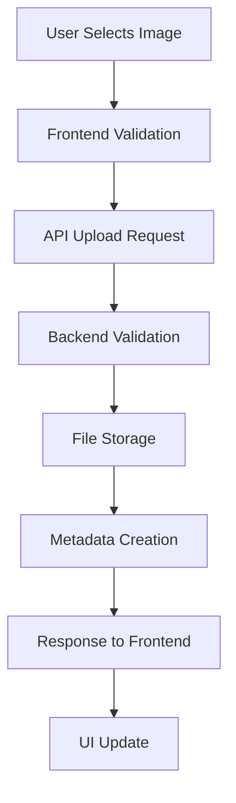

#### Detailed Sequence Diagram
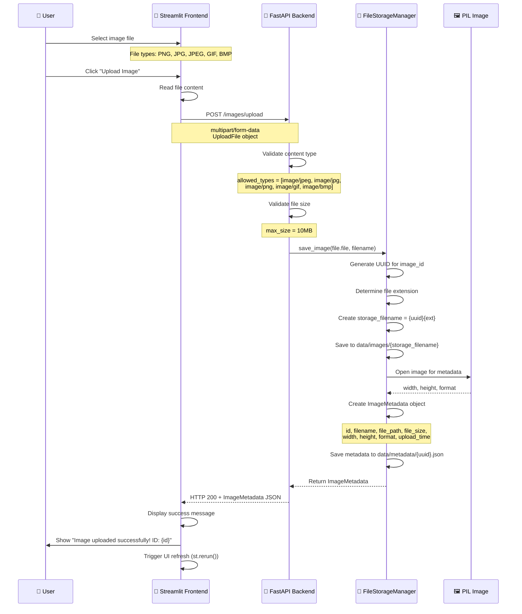

#### Data Structures

**Input Data:**
```python
# FastAPI UploadFile
class UploadFile:
    filename: str              # Original filename
    content_type: str         # MIME type (e.g., "image/png")
    file: BinaryIO           # File stream
    size: Optional[int]      # File size in bytes
```

**Validation Rules:**
```python
# Content Type Validation
ALLOWED_TYPES = [
    "image/jpeg", 
    "image/jpg", 
    "image/png", 
    "image/gif", 
    "image/bmp"
]

# Size Validation  
MAX_FILE_SIZE = 10 * 1024 * 1024  # 10MB

# File Extension Mapping
EXTENSION_MAPPING = {
    "image/jpeg": ".jpg",
    "image/jpg": ".jpg", 
    "image/png": ".png",
    "image/gif": ".gif",
    "image/bmp": ".bmp"
}
```

**Storage Paths:**
```bash
data/
├── images/
│   └── {uuid}.{ext}              # Original image file
├── metadata/  
│   └── {uuid}.json               # Image metadata
├── annotations/
│   └── {uuid}.json               # Annotation data (future)
└── predictions/
    └── {uuid}.json               # LLM predictions (future)
```

**Output Data:**
```python
# ImageMetadata Response
{
    "id": "550e8400-e29b-41d4-a716-446655440000",
    "filename": "ui_screenshot.png",
    "file_path": "/app/data/images/550e8400-e29b-41d4-a716-446655440000.png",
    "file_size": 245760,
    "width": 1920,
    "height": 1080, 
    "format": "PNG",
    "upload_time": "2024-01-01T12:00:00.000Z",
    "annotation_count": 0,
    "has_ai_predictions": false
}
```

#### Error Scenarios

| Error Type           | HTTP Code | Response                              | Frontend Action         |
| -------------------- | --------- | ------------------------------------- | ----------------------- |
| Invalid file type    | 400       | `{"detail": "Unsupported file type"}` | Show error message      |
| File too large       | 400       | `{"detail": "File too large"}`        | Show size limit message |
| Storage failure      | 500       | `{"detail": "Error saving image"}`    | Show retry option       |
| PIL processing error | 500       | `{"detail": "Invalid image file"}`    | Show format error       |

---

### 1.2 Enhanced Upload Flow with LLM Validation (Phase 2)

#### High-Level Overview
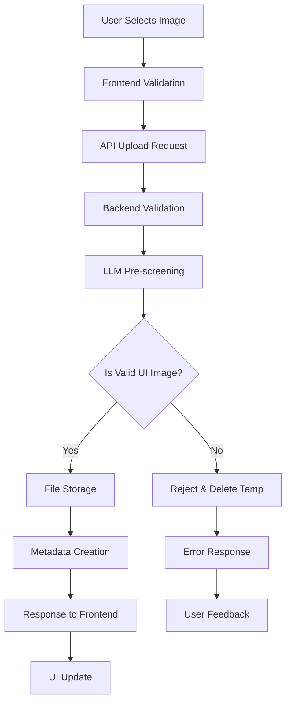

#### Enhanced Sequence Diagram
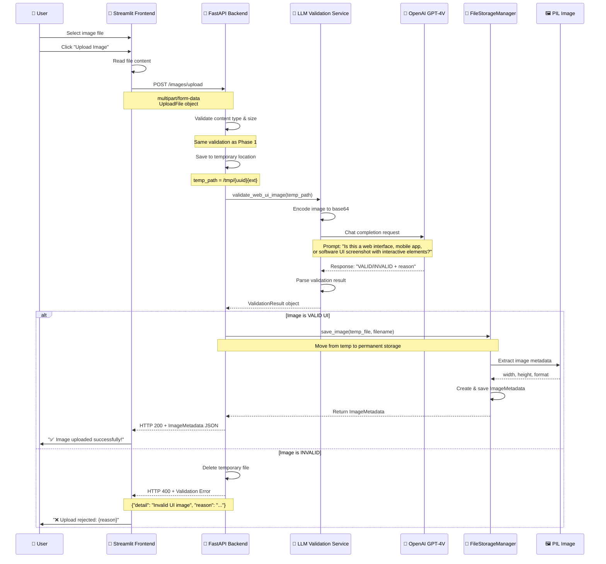

#### LLM Validation Implementation

**New Service Class:**
```python
class UIImageValidationService:
    """Service for validating UI images using LLM"""
    
    def __init__(self, llm_service: LLMUIDetectionService):
        self.llm_service = llm_service
        
    async def validate_web_ui_image(self, image_path: str) -> ValidationResult:
        """Validate if image contains web UI components"""
        
        # Encode image for LLM processing
        base64_image = self.llm_service.encode_image(image_path)
        
        # Create validation prompt
        prompt = """
        Analyze this image and determine if it's a web interface, mobile app, 
        or software UI screenshot that contains interactive elements.
        
        Look for:
        - Buttons, input fields, dropdowns, radio buttons
        - Navigation menus, toolbars, forms
        - Layout consistent with web/app interfaces
        - Interactive UI components
        
        AVOID accepting:
        - Photos of people, landscapes, objects
        - Documents, PDFs, text-only images  
        - Drawings, illustrations, diagrams
        - Random screenshots without UI elements
        
        Respond in this exact format:
        RESULT: VALID or INVALID
        CONFIDENCE: 0.0 to 1.0
        REASON: Brief explanation (max 50 words)
        """
        
        # Make LLM API call
        response = await self.llm_service.client.chat.completions.create(
            model="gpt-4-vision-preview",
            messages=[{
                "role": "user", 
                "content": [
                    {"type": "text", "text": prompt},
                    {"type": "image_url", "image_url": {
                        "url": f"data:image/jpeg;base64,{base64_image}"
                    }}
                ]
            }],
            max_tokens=150,
            temperature=0.1
        )
        
        # Parse response
        content = response.choices[0].message.content
        
        # Extract validation result
        is_valid = "RESULT: VALID" in content
        confidence = self._extract_confidence(content)
        reason = self._extract_reason(content)
        
        return ValidationResult(
            valid=is_valid,
            confidence=confidence,
            reason=reason,
            processing_time=time.time() - start_time
        )
```

**Updated Data Models:**
```python
class ValidationResult(BaseModel):
    """Result of image validation"""
    valid: bool
    confidence: float = Field(ge=0.0, le=1.0)
    reason: str
    processing_time: float  # in seconds
    
class ImageMetadata(BaseModel):
    """Enhanced with validation info"""
    # ... existing fields ...
    validation_result: Optional[ValidationResult] = None
    validation_timestamp: Optional[datetime] = None
```

**Enhanced Upload Endpoint:**
```python
@app.post("/images/upload", response_model=ImageMetadata)
async def upload_image_with_validation(file: UploadFile = File(...)):
    """Upload image with LLM-based UI validation"""
    
    # Phase 1 validation (file type, size)
    validate_upload_file(file)
    
    # Save to temporary location
    temp_path = await save_temp_file(file)
    
    try:
        # LLM validation
        validation_result = await ui_validator.validate_web_ui_image(temp_path)
        
        if not validation_result.valid:
            # Reject upload
            os.unlink(temp_path)  # Delete temp file
            raise HTTPException(
                status_code=400,
                detail={
                    "message": "Image rejected: Not a valid UI screenshot",
                    "reason": validation_result.reason,
                    "confidence": validation_result.confidence
                }
            )
        
        # Move to permanent storage
        metadata = storage_manager.save_validated_image(
            temp_path, file.filename, validation_result
        )
        
        return metadata
        
    except Exception as e:
        # Cleanup on any error
        if temp_path.exists():
            os.unlink(temp_path)
        raise
```

#### Performance Considerations

**Validation Timing:**
- **Target**: < 5 seconds per image
- **Timeout**: 10 seconds with fallback
- **Fallback Strategy**: If LLM fails, allow upload with warning

**Cost Optimization:**
- **Image Resizing**: Resize to max 1024px before sending to LLM
- **Caching**: Cache validation results by image hash
- **Batch Processing**: Group multiple validations if needed

**User Experience:**
```python
# Frontend enhancement
with st.spinner("🔍 Validating image content..."):
    response = api_client.upload_image_with_validation(file_content, filename)
    
if response.get("validation_result"):
    confidence = response["validation_result"]["confidence"]
    if confidence < 0.8:
        st.warning(f"⚠️ Low confidence ({confidence:.2f}) - please verify this is a UI screenshot")
    else:
        st.success(f"✅ Validated as UI image (confidence: {confidence:.2f})")
```

---

## Future Data Flows

*Note: The following sections will be populated as we implement additional features*

### 2. Annotation Data Flow

#### High-Level Overview
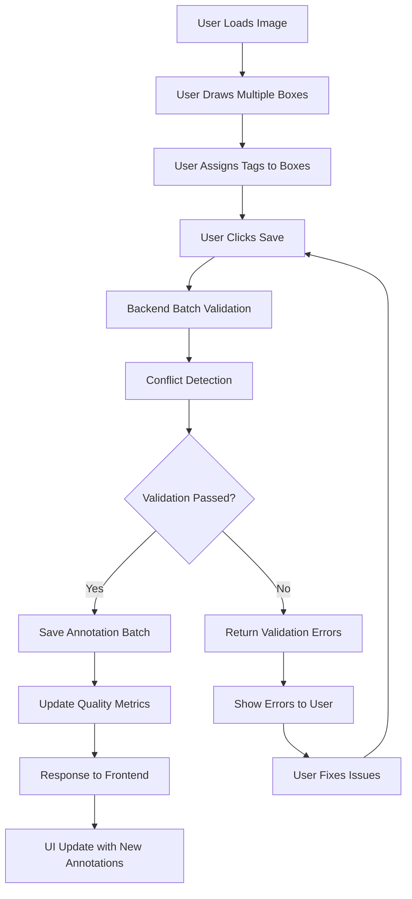

#### Detailed Sequence Diagram
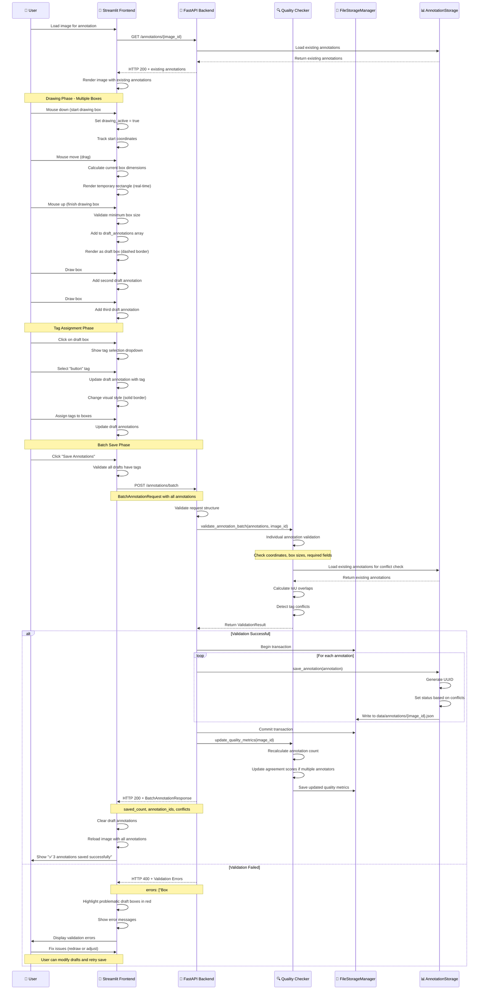

#### Current Implementation Status (Updated: Phase 1.1)

**✅ Phase 1.1 Core Features Completed:**
- Image upload and validation system
- Enhanced FastAPI backend with comprehensive error handling
- File storage management with metadata
- Basic annotation data models
- Streamlit frontend with image gallery
- Import path resolution fixes for Docker deployment

**⚠️ Known Limitation - Annotation Canvas JavaScript Communication:**
The annotation canvas has a JavaScript-to-Python communication limitation in Streamlit. The canvas correctly draws bounding boxes and stores them in the JavaScript local state, but transferring these annotations to the Python session state is not fully implemented.

**Current Workaround:**
- ✅ Canvas draws boxes visually (working)
- ⚠️ "Sync Annotations" button in canvas (partially implemented)
- ✅ "🧪 Add Test Box" button to manually create annotations for testing
- ✅ Manual annotation entry in debug section for precise coordinate input
- ✅ Annotation controls for tagging (working when annotations exist)
- ✅ Save functionality to backend API (working)

**Technical Issue:**
Streamlit's `components.html()` doesn't provide a reliable way to receive `postMessage` data from JavaScript back to Python. The JavaScript sends messages via `window.parent.postMessage()`, but there's no listener on the Python side.

**Simplified Data Model (Business Requirement):**
- ❌ Removed manual annotation names feature (business decision)
- ✅ Streamlined to core UI element tagging only: button, input, radio, dropdown
- ✅ Simplified workflow: Draw → Tag → Save
- ✅ Cleaner JSON output without unnecessary fields

**Future Solutions:**
1. **Custom Streamlit Component**: Build a proper bidirectional component
2. **Alternative Interaction Model**: Use different approach (e.g., form-based coordinate input)
3. **WebSocket Integration**: Real-time communication channel

#### Data Structures

**Frontend Draft State (Simplified Model):**
```python
class DraftAnnotation(BaseModel):
    temp_id: str                    # Temporary ID (e.g., "temp_1")
    bounding_box: BoundingBox       # Coordinates from drawing
    tag: Optional[UIElementTag] = None  # User-assigned tag (button, input, radio, dropdown)
    created_at: datetime            # Local creation time
    
class AnnotationSession(BaseModel):
    image_id: str
    draft_annotations: List[DraftAnnotation] = []
    is_drawing: bool = False
    current_temp_box: Optional[BoundingBox] = None
    
    def add_draft(self, bbox: BoundingBox) -> str:
        """Add new draft annotation and return temp ID"""
        temp_id = f"temp_{len(self.draft_annotations) + 1}"
        draft = DraftAnnotation(
            temp_id=temp_id,
            bounding_box=bbox,
            created_at=datetime.now()
        )
        self.draft_annotations.append(draft)
        return temp_id
    
    def assign_tag(self, temp_id: str, tag: UIElementTag):
        """Assign UI element tag to a draft annotation"""
        for draft in self.draft_annotations:
            if draft.temp_id == temp_id:
                draft.tag = tag
                break
    
    def ready_to_save(self) -> bool:
        """Check if all drafts have tags assigned"""
        return len(self.draft_annotations) > 0 and all(
            draft.tag is not None for draft in self.draft_annotations
        )
```

**API Request/Response Models (Simplified):**
```python
class BatchAnnotationRequest(BaseModel):
    image_id: str
    created_by: str                 # Annotator identifier
    annotations: List[AnnotationRequest]
    
class AnnotationRequest(BaseModel):
    bounding_box: BoundingBox
    tag: UIElementTag               # Required: button, input, radio, dropdown
    confidence: Optional[float] = None
    reasoning: Optional[str] = None

class BatchAnnotationResponse(BaseModel):
    saved_count: int
    annotation_ids: List[str]       # UUIDs of saved annotations
    conflicts: List[ConflictInfo] = []
    warnings: List[str] = []
    processing_time: float          # Seconds
    
class ValidationResult(BaseModel):
    valid: bool
    errors: List[ValidationError] = []
    warnings: List[ValidationWarning] = []
    conflicts: List[ConflictInfo] = []
```

**Storage Format:**
```bash
data/
├── annotations/
│   └── {image_uuid}.json         # All annotations for an image
└── quality/
    └── {image_uuid}.json         # Quality metrics for an image
```

**Annotation File Structure (Simplified):**
```json
{
  "image_id": "550e8400-e29b-41d4-a716-446655440000",
  "last_updated": "2024-01-01T15:30:00.000Z",
  "annotation_count": 3,
  "annotations": [
    {
      "id": "ann_001",
      "bounding_box": {"x": 50, "y": 100, "width": 120, "height": 40},
      "tag": "button",
      "confidence": null,
      "created_by": "user_123",
      "created_at": "2024-01-01T15:25:00.000Z",
      "status": "active",
      "conflicts_with": [],
      "reasoning": null
    },
    {
      "id": "ann_002", 
      "bounding_box": {"x": 200, "y": 150, "width": 180, "height": 35},
      "tag": "input",
      "confidence": null,
      "created_by": "user_123",
      "created_at": "2024-01-01T15:26:00.000Z",
      "status": "conflicted",
      "conflicts_with": ["ann_004"]
    }
  ]
}
```

#### Validation Rules

**Individual Annotation Validation:**
```python
def validate_single_annotation(annotation: AnnotationRequest, 
                              image_metadata: ImageMetadata) -> List[ValidationError]:
    """Validate individual annotation"""
    errors = []
    bbox = annotation.bounding_box
    
    # Size validation
    if bbox.width < MIN_BOX_WIDTH or bbox.height < MIN_BOX_HEIGHT:
        errors.append(ValidationError(
            field="bounding_box",
            message=f"Box too small (minimum {MIN_BOX_WIDTH}x{MIN_BOX_HEIGHT})",
            value=f"{bbox.width}x{bbox.height}"
        ))
    
    # Boundary validation
    if (bbox.x < 0 or bbox.y < 0 or 
        bbox.x + bbox.width > image_metadata.dimensions.width or
        bbox.y + bbox.height > image_metadata.dimensions.height):
        errors.append(ValidationError(
            field="bounding_box", 
            message="Box extends outside image boundaries",
            value=f"Image: {image_metadata.dimensions.width}x{image_metadata.dimensions.height}"
        ))
    
    # Tag validation
    if annotation.tag not in UIElementTag.__members__.values():
        errors.append(ValidationError(
            field="tag",
            message="Invalid UI element tag",
            value=str(annotation.tag)
        ))
    
    return errors

def validate_annotation_batch(annotations: List[AnnotationRequest],
                            image_id: str) -> ValidationResult:
    """Validate entire annotation batch"""
    errors = []
    warnings = []
    conflicts = []
    
    # Load image metadata
    image_metadata = load_image_metadata(image_id)
    
    # 1. Individual validation
    for i, annotation in enumerate(annotations):
        annotation_errors = validate_single_annotation(annotation, image_metadata)
        for error in annotation_errors:
            error.field = f"annotation_{i}.{error.field}"
            errors.append(error)
    
    # 2. Cross-annotation validation (within batch)
    for i, ann1 in enumerate(annotations):
        for j, ann2 in enumerate(annotations[i+1:], i+1):
            iou = calculate_iou(ann1.bounding_box, ann2.bounding_box)
            if iou > OVERLAP_THRESHOLD:
                conflicts.append(ConflictInfo(
                    annotation_id=f"temp_{i}",
                    conflicts_with=[f"temp_{j}"],
                    conflict_type=ConflictType.OVERLAP,
                    severity=iou,
                    iou_score=iou
                ))
    
    # 3. Conflict with existing annotations
    existing_annotations = load_existing_annotations(image_id)
    for i, new_annotation in enumerate(annotations):
        for existing in existing_annotations:
            iou = calculate_iou(new_annotation.bounding_box, existing.bounding_box)
            if iou > OVERLAP_THRESHOLD:
                conflicts.append(ConflictInfo(
                    annotation_id=f"temp_{i}",
                    conflicts_with=[existing.id],
                    conflict_type=ConflictType.OVERLAP,
                    severity=iou,
                    iou_score=iou
                ))
    
    return ValidationResult(
        valid=len(errors) == 0,
        errors=errors,
        warnings=warnings,
        conflicts=conflicts
    )
```

#### Configuration Settings

```python
# Validation Thresholds
MIN_BOX_WIDTH = 10              # Minimum box width in pixels
MIN_BOX_HEIGHT = 10             # Minimum box height in pixels
OVERLAP_THRESHOLD = 0.5         # IoU threshold for conflict detection
MAX_ANNOTATIONS_PER_BATCH = 50  # Prevent extremely large batches

# Visual Settings (Frontend)
DRAFT_BOX_COLOR = "#007bff"     # Blue for draft annotations
TAGGED_BOX_COLOR = "#28a745"    # Green for tagged annotations  
CONFLICT_BOX_COLOR = "#dc3545"  # Red for conflicted annotations
EXISTING_BOX_COLOR = "#6c757d"  # Gray for existing annotations

# Performance Settings
BATCH_SAVE_TIMEOUT = 30         # Seconds
MAX_CONFLICT_CHECKS = 1000      # Prevent excessive computation
```

#### Error Scenarios

| Error Type            | HTTP Code | Response Example                                                                               | Frontend Action                                  |
| --------------------- | --------- | ---------------------------------------------------------------------------------------------- | ------------------------------------------------ |
| **Validation Errors** | 400       | `{"detail": {"errors": [{"field": "annotation_0.bounding_box", "message": "Box too small"}]}}` | Highlight problematic boxes, show error messages |
| **Missing Tags**      | 400       | `{"detail": "All annotations must have tags assigned"}`                                        | Highlight untagged boxes, prompt user            |
| **Storage Failure**   | 500       | `{"detail": "Failed to save annotation batch"}`                                                | Show retry option, preserve draft state          |
| **Conflict Warnings** | 200       | `{"saved_count": 3, "conflicts": [...]}`                                                       | Show conflict notifications, offer resolution    |
| **Image Not Found**   | 404       | `{"detail": "Image not found"}`                                                                | Redirect to image selection                      |

#### Performance Considerations

**Frontend Optimizations:**
```javascript
// Debounced real-time rendering during drawing
const renderTempBox = debounce((box) => {
    updateCanvasOverlay(box);
}, 16); // ~60fps

// Efficient draft state management
const addDraftAnnotation = (bbox) => {
    setDraftAnnotations(prev => [...prev, {
        temp_id: `temp_${Date.now()}`,
        bounding_box: bbox,
        tag: null
    }]);
};
```

**Backend Optimizations:**
```python
# Batch processing with transaction support
async def save_annotation_batch(annotations: List[AnnotationRequest], 
                               image_id: str) -> BatchAnnotationResponse:
    """Save multiple annotations atomically"""
    
    async with database_transaction():
        saved_annotations = []
        
        for annotation_request in annotations:
            # Create annotation with UUID
            annotation = Annotation(
                id=str(uuid.uuid4()),
                image_id=image_id,
                **annotation_request.dict()
            )
            
            # Determine status based on conflicts
            conflicts = await detect_conflicts(annotation, image_id)
            annotation.status = AnnotationStatus.CONFLICTED if conflicts else AnnotationStatus.ACTIVE
            
            # Save to storage
            await annotation_storage.save(annotation)
            saved_annotations.append(annotation)
        
        # Update quality metrics once per batch
        await quality_service.update_metrics(image_id)
        
        return BatchAnnotationResponse(
            saved_count=len(saved_annotations),
            annotation_ids=[ann.id for ann in saved_annotations],
            conflicts=await get_all_conflicts(image_id)
        )
```

**Memory Management:**
```python
# Limit batch size to prevent memory issues
MAX_BATCH_SIZE = 50

# Efficient conflict detection with early termination
def detect_conflicts_optimized(new_annotations: List[Annotation], 
                              existing_annotations: List[Annotation]) -> List[ConflictInfo]:
    """Optimized conflict detection with spatial indexing"""
    conflicts = []
    
    # Use spatial indexing for large annotation sets
    if len(existing_annotations) > 100:
        spatial_index = build_spatial_index(existing_annotations)
        for new_ann in new_annotations:
            nearby = spatial_index.query(new_ann.bounding_box)
            conflicts.extend(check_conflicts(new_ann, nearby))
    else:
        # Simple O(n²) for small sets
        for new_ann in new_annotations:
            conflicts.extend(check_conflicts(new_ann, existing_annotations))
    
    return conflicts
```

---

### 3. LLM Prediction Data Flow

#### 3.1 MVP MCP-Enhanced Prediction Flow

**📖 Complete MCP Architecture:** See [MCP_ARCHITECTURE.md](./MCP_ARCHITECTURE.md) for detailed MCP specifications.

**Overview**: Enhanced prediction flow using simplified MCP integration with basic context awareness.

#### High-Level MCP Flow
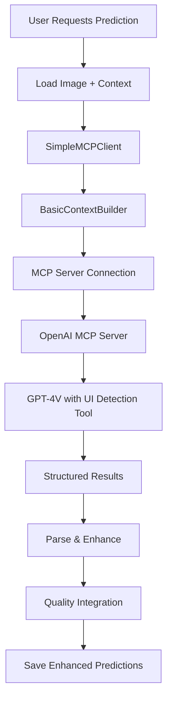

#### Detailed MCP Sequence Diagram
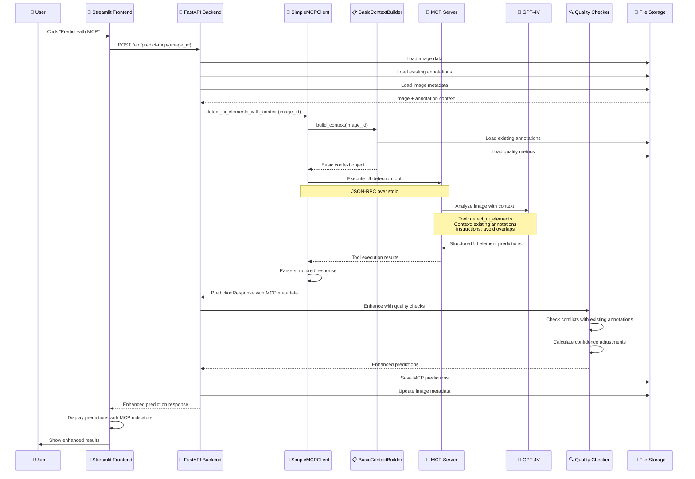

#### MCP Context Building Process

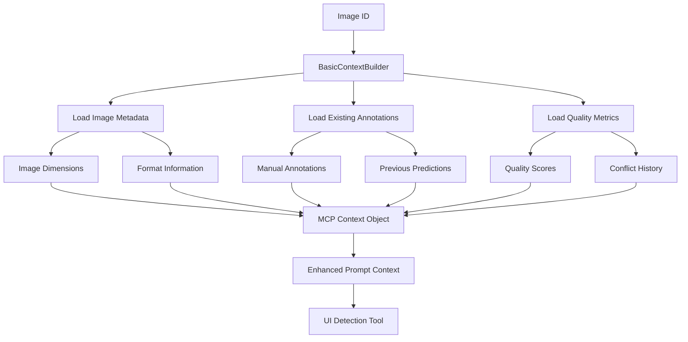

#### MVP MCP Data Structures

**Context Input:**
```json
{
  "image_id": "15d02cb6-8498-4ad3-8169-058496bfab22",
  "task": "ui_element_detection",
  "image_metadata": {
    "dimensions": {"width": 1920, "height": 1080},
    "format": "PNG"
  },
  "existing_annotations": [
    {
      "tag": "button",
      "bounding_box": {"x": 50, "y": 50, "width": 100, "height": 30},
      "created_by": "manual",
      "confidence": null
    }
  ],
  "detection_instructions": "Detect UI elements while avoiding overlap with existing annotations"
}
```

**Enhanced Prediction Output:**
```json
{
  "prediction_id": "pred_15d02cb6_mcp_1704102000",
  "image_id": "15d02cb6-8498-4ad3-8169-058496bfab22",
  "model_version": "gpt-4-vision-mcp-mvp",
  "processing_time": 2.8,
  "total_elements": 3,
  "status": "completed",
  "mcp_enabled": true,
  "context_used": true,
  "elements": [
    {
      "id": "elem_0_mcp",
      "tag": "input",
      "bounding_box": {"x": 100, "y": 80, "width": 200, "height": 25},
      "confidence": 0.87,
      "reasoning": "Text input field with visible border, positioned to avoid existing button annotation"
    }
  ],
  "mcp_metadata": {
    "context_sources": ["existing_annotations", "image_metadata"],
    "conflict_avoided": true,
    "fallback_used": false
  }
}
```

#### Error Handling & Fallback Flow

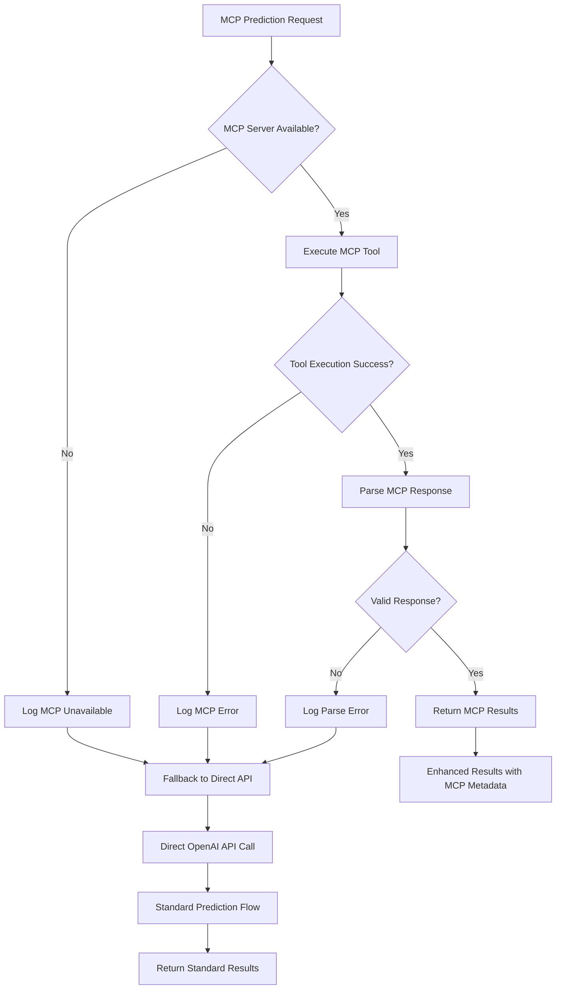

#### Performance Considerations

| Aspect                 | MVP MCP                            | Target              | Mitigation             |
| ---------------------- | ---------------------------------- | ------------------- | ---------------------- |
| **Response Time**      | 2-4 seconds longer than direct API | < 10 seconds total  | Timeout and fallback   |
| **Context Building**   | 0.2-0.5 seconds                    | < 1 second          | Cache annotations      |
| **MCP Server Startup** | 1-2 seconds first call             | Acceptable          | Keep server warm       |
| **Fallback Rate**      | Target < 10%                       | Monitor reliability | Improve error handling |

#### Integration Points

| System Component    | MCP Integration                            | Changes Required                |
| ------------------- | ------------------------------------------ | ------------------------------- |
| **FastAPI Backend** | Add `/api/predict-mcp/{image_id}` endpoint | New endpoint alongside existing |
| **File Storage**    | Enhanced prediction metadata               | Backward compatible format      |
| **Quality System**  | MCP metadata integration                   | Enhanced conflict detection     |
| **Frontend**        | MCP prediction display                     | Enhanced UI indicators          |

#### 3.2 Image Processing and Coordinate Scaling

**Critical Issue**: Coordinate scaling problem discovered and resolved in production deployment.

#### Problem Description

During testing, a critical coordinate accuracy issue was identified in the AI annotation system:

1. **Root Cause**: Large images (e.g., 3300×1486 pixels) were automatically resized to max 1024px for efficient LLM processing
2. **Bug**: AI returned coordinates for the **resized image** but the system treated them as **original image coordinates**
3. **Impact**: Coordinates were dramatically incorrect - appearing 3x+ too small and mispositioned

#### Before/After Comparison

| Metric             | Before Fix           | After Fix                 | Status  |
| ------------------ | -------------------- | ------------------------- | ------- |
| **AI Coordinates** | 20-340 (tiny, wrong) | 64-1450 (proper scale)    | ✅ Fixed |
| **Scale Factor**   | Ignored ❌            | 0.310 tracked & applied ✅ | ✅ Fixed |
| **Within Bounds**  | No ❌                 | Yes ✅                     | ✅ Fixed |
| **Accuracy**       | Completely off ❌     | Mathematically correct ✅  | ✅ Fixed |

#### Comprehensive Technical Solution

**Enhanced LLM Service** (`services/llm_service.py`):
```python
def _preprocess_image_for_llm(self, image_path: str) -> Tuple[str, float, int, int]:
    """
    Preprocess image for LLM processing, handling resizing if needed
    
    Returns:
        Tuple of (processed_image_path, scale_factor, resized_width, resized_height)
        scale_factor = 1.0 if no resizing was done
        scale_factor < 1.0 if image was scaled down
    """
    # Calculate resize ratio and track both original and resized dimensions
    # ... resize logic ...
    return resized_path, scale_factor, new_width, new_height

def _validate_and_scale_coordinates(
    self, bbox_data: dict, scale_factor: float, resized_width: int, resized_height: int
) -> dict:
    """Validate coordinates are within bounds before scaling back to original dimensions"""
    
    # First validate that coordinates are within the resized image bounds
    x, y, width, height = bbox_data["x"], bbox_data["y"], bbox_data["width"], bbox_data["height"]
    
    # Check bounds on resized image BEFORE scaling
    if (x < 0 or y < 0 or 
        x + width > resized_width or 
        y + height > resized_height or
        width <= 0 or height <= 0):
        
        print(f"WARNING: LLM provided out-of-bounds coordinates: "
              f"({x}, {y}) {width}×{height} on {resized_width}×{resized_height} image. "
              f"Clamping to valid range.")
        
        # Clamp coordinates to valid range
        x = max(0, min(x, resized_width - 1))
        y = max(0, min(y, resized_height - 1))
        width = max(1, min(width, resized_width - x))
        height = max(1, min(height, resized_height - y))
        
        bbox_data = {"x": x, "y": y, "width": width, "height": height}
    
    # Now scale to original dimensions
    if scale_factor == 1.0:
        return bbox_data

    return {
        "x": bbox_data["x"] / scale_factor,
        "y": bbox_data["y"] / scale_factor,
        "width": bbox_data["width"] / scale_factor,
        "height": bbox_data["height"] / scale_factor,
    }
```

**Enhanced LLM Prompt with Coordinate Validation**:
```python
prompt = f"""
🖼️ CRITICAL COORDINATE INFORMATION:
- Image dimensions: {resized_width} × {resized_height} pixels
- Coordinate system: (0,0) is TOP-LEFT corner
- Maximum valid coordinates: x < {resized_width}, y < {resized_height}
- ALL coordinates must be within image bounds!

⚠️ COORDINATE VALIDATION RULES:
- x coordinate: 0 ≤ x < {resized_width}
- y coordinate: 0 ≤ y < {resized_height}  
- width: 1 ≤ width ≤ {resized_width}
- height: 1 ≤ height ≤ {resized_height}
- x + width ≤ {resized_width}
- y + height ≤ {resized_height}

ENSURE ALL COORDINATES ARE WITHIN THE IMAGE BOUNDS: {resized_width}×{resized_height}!
...
"""
```

**Enhanced MCP Service** (`services/mcp_service.py`):
- Added identical coordinate validation functionality for image data (bytes)
- Ensures both AI services work consistently with proper coordinate scaling
- Uses same validation logic before scaling coordinates back to original dimensions

#### Updated Prediction Data Flow

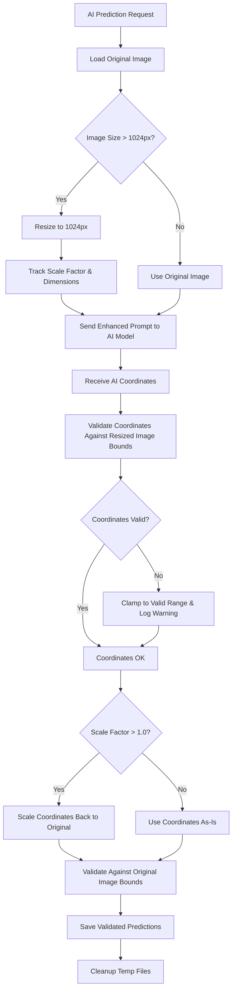

#### Coordinate Validation Process

**Step 1: Bounds Check Before Scaling**
```python
# Example: 3300×1486 image resized to 1024×461
# LLM returns: (1200, 300, 150, 50) - OUT OF BOUNDS for 1024×461!

# Validation catches this:
if x + width > resized_width:  # 1200 + 150 > 1024
    # Clamp: x = min(1200, 1024-1) = 1023, width = min(150, 1024-1023) = 1
    
# Result: (1023, 300, 1, 50) - now within bounds before scaling
```

**Step 2: Scale to Original Dimensions**
```python
# Scale back: (1023, 300, 1, 50) with scale_factor = 0.310
# Result: (3300, 967, 3, 161) - fits within 3300×1486 original image
```

#### Scale Factor Mathematics

Example for 3300×1486 image:
```python
# Original image: 3300×1486 → resized to 1024×461
scale_factor = 1024 / 3300 = 0.310

# Enhanced process:
# 1. AI returns coordinates for 1024×461 image: (317, 142)
# 2. Validate: 317 < 1024 ✅, 142 < 461 ✅
# 3. Scale back: 317 / 0.310 = 1023 (original coordinates)
# 4. Verify: 1023 < 3300 ✅ (fits within original image)

# Verification: scaled coordinates fit within original bounds
scaled_coordinates <= original_dimensions  # ✅ Always true after validation
```

#### Diagnostic Results Verification

**Before Fix** (Broken):
```
🤖 AI Predictions: 3 found
  1. button: (4189.5, 161.1) 2255.9×322.3
     ❌ OUT OF BOUNDS! (Image is 3300×1486)
        Extends 3145.3px beyond right edge
```

**After Fix** (Working):
```
🤖 AI Predictions: 3 found
  1. button: (1327.7, 64.5) 644.5×128.9
     ✅ Within bounds
  2. button: (1005.5, 1127.9) 483.4×161.1
     ✅ Within bounds
  3. button: (1650.0, 1127.9) 483.4×161.1
     ✅ Within bounds
```

#### Impact on Data Structures

**Before Fix** (Incorrect):
```json
{
  "bounding_box": {
    "x": 4189.5,    // Wrong: extends far beyond 3300px image width
    "y": 161.1,     // Wrong: calculated from incorrect scaling
    "width": 2255.9,
    "height": 322.3
  }
}
```

**After Fix** (Correct):
```json
{
  "bounding_box": {
    "x": 1327.7,     // Correct: within 3300px image bounds
    "y": 64.5,       // Correct: within 1486px image bounds
    "width": 644.5,
    "height": 128.9
  }
}
```

#### Enhanced Monitoring and Validation

**Real-time Coordinate Validation** (`utils/coordinate_validator.py`):
```python
def validate_coordinates(annotations, image_width, image_height):
    """Validate coordinates against image boundaries with detailed logging"""
    for annotation in annotations:
        bbox = annotation["bounding_box"]
        
        # Check bounds with detailed error reporting
        max_x = bbox["x"] + bbox["width"]
        max_y = bbox["y"] + bbox["height"]
        
        assert max_x <= image_width, f"X coordinates exceed image width: {max_x} > {image_width}"
        assert max_y <= image_height, f"Y coordinates exceed image height: {max_y} > {image_height}"
        assert bbox["x"] >= 0 and bbox["y"] >= 0, f"Negative coordinates detected"
        assert bbox["width"] > 0 and bbox["height"] > 0, f"Invalid dimensions"
```

**Enhanced Logging Output**:
```
🤖 Regenerating AI predictions with coordinate validation...
Resized image from 3300x1486 to 1024x461 (scale factor: 0.310) for LLM processing
✅ All LLM coordinates within resized image bounds: 1024×461
Scaled 3 annotations from resized image (scale factor: 0.310) back to original dimensions
✅ All scaled coordinates within original image bounds: 3300×1486
✅ Coordinate validation successful: predictions render correctly in UI
```

This comprehensive fix ensures **mathematically correct coordinates** for all image sizes while maintaining AI processing efficiency through image resizing. The enhanced validation prevents out-of-bounds coordinates at both the resized and original image scales, ensuring reliable rendering in the enhanced annotation viewer.

#### Future Enhancement Path

**Phase 2 Advanced MCP Features** (Deferred from MVP):
- Session-based learning across predictions
- Advanced multi-tool orchestration
- Real-time user feedback integration
- Cross-image pattern recognition
- Predictive quality assessment

This MVP MCP flow provides immediate improvements in prediction quality through context awareness while maintaining system stability and providing a foundation for future advanced features.

### 4. Quality Management Data Flow
*To be documented when implementing quality management*

### 5. Export Data Flow
*To be documented when implementing export features*

### 6. Error Handling Flows
*To be documented as error handling patterns emerge*

---

## Implementation Notes

### File Organization
```bash
services/
├── ui_validation_service.py     # New LLM validation service
├── llm_service.py              # Enhanced existing service  
└── file_storage_service.py     # Enhanced storage management

models/
├── validation_models.py        # New validation data models
└── annotation_models.py        # Enhanced existing models
```

### Configuration
```python
# Environment variables
OPENAI_API_KEY=your_key_here
LLM_VALIDATION_ENABLED=true
LLM_VALIDATION_TIMEOUT=10
LLM_VALIDATION_CONFIDENCE_THRESHOLD=0.7
```

### Monitoring & Metrics
```python
# Metrics to track
validation_requests_total
validation_success_rate  
validation_processing_time
validation_confidence_distribution
false_positive_rate
false_negative_rate
```

---

*This document will be continuously updated as new data flows are implemented and existing flows are enhanced.* 