```mermaid
sequenceDiagram
    participant User as 👤 User
    participant SF as 🎨 Streamlit Frontend
    participant API as 🔧 FastAPI Backend
    participant FS as 💾 FileStorageManager
    participant PIL as 🖼️ PIL Image
    
    User->>SF: Select image file
    Note over SF: File types: PNG, JPG, JPEG, GIF, BMP
    
    User->>SF: Click "Upload Image"
    SF->>SF: Read file content
    
    SF->>API: POST /images/upload
    Note over SF,API: multipart/form-data<br/>UploadFile object
    
    API->>API: Validate content type
    Note over API: allowed_types = [image/jpeg, image/jpg,<br/>image/png, image/gif, image/bmp]
    
    API->>API: Validate file size
    Note over API: max_size = 10MB
    
    API->>FS: save_image(file.file, filename)
    FS->>FS: Generate UUID for image_id
    FS->>FS: Determine file extension
    FS->>FS: Create storage_filename = {uuid}{ext}
    FS->>FS: Save to data/images/{storage_filename}
    
    FS->>PIL: Open image for metadata
    PIL-->>FS: width, height, format
    
    FS->>FS: Create ImageMetadata object
    Note over FS: id, filename, file_path, file_size,<br/>width, height, format, upload_time
    
    FS->>FS: Save metadata to data/metadata/{uuid}.json
    FS-->>API: Return ImageMetadata
    
    API-->>SF: HTTP 200 + ImageMetadata JSON
    SF->>SF: Display success message
    SF->>User: Show "Image uploaded successfully! ID: {id}"
    SF->>SF: Trigger UI refresh (st.rerun())
```

# Data Flow Documentation

## Overview

This document serves as the **single source of truth** for all data flows within the UI Component Labeling System. It provides detailed technical specifications, sequence diagrams, and implementation details for every data flow in the system.

---

## Table of Contents

1. [Upload Data Flow](#upload-data-flow)
2. [Annotation Data Flow](#annotation-data-flow) 
3. [LLM Prediction Data Flow](#llm-prediction-data-flow)
4. [Quality Management Data Flow](#quality-management-data-flow)
5. [Export Data Flow](#export-data-flow)
6. [Error Handling Flows](#error-handling-flows)

---

## Upload Data Flow

### 1.1 Current Upload Flow (Phase 1)

#### High-Level Overview


#### Detailed Sequence Diagram


#### Data Structures

**Input Data:**
```python
# FastAPI UploadFile
class UploadFile:
    filename: str              # Original filename
    content_type: str         # MIME type (e.g., "image/png")
    file: BinaryIO           # File stream
    size: Optional[int]      # File size in bytes
```

**Validation Rules:**
```python
# Content Type Validation
ALLOWED_TYPES = [
    "image/jpeg", 
    "image/jpg", 
    "image/png", 
    "image/gif", 
    "image/bmp"
]

# Size Validation  
MAX_FILE_SIZE = 10 * 1024 * 1024  # 10MB

# File Extension Mapping
EXTENSION_MAPPING = {
    "image/jpeg": ".jpg",
    "image/jpg": ".jpg", 
    "image/png": ".png",
    "image/gif": ".gif",
    "image/bmp": ".bmp"
}
```

**Storage Paths:**
```bash
data/
├── images/
│   └── {uuid}.{ext}              # Original image file
├── metadata/  
│   └── {uuid}.json               # Image metadata
├── annotations/
│   └── {uuid}.json               # Annotation data (future)
└── predictions/
    └── {uuid}.json               # LLM predictions (future)
```

**Output Data:**
```python
# ImageMetadata Response
{
    "id": "550e8400-e29b-41d4-a716-446655440000",
    "filename": "ui_screenshot.png",
    "file_path": "/app/data/images/550e8400-e29b-41d4-a716-446655440000.png",
    "file_size": 245760,
    "width": 1920,
    "height": 1080, 
    "format": "PNG",
    "upload_time": "2024-01-01T12:00:00.000Z",
    "annotation_count": 0,
    "has_ai_predictions": false
}
```

#### Error Scenarios

| Error Type           | HTTP Code | Response                              | Frontend Action         |
| -------------------- | --------- | ------------------------------------- | ----------------------- |
| Invalid file type    | 400       | `{"detail": "Unsupported file type"}` | Show error message      |
| File too large       | 400       | `{"detail": "File too large"}`        | Show size limit message |
| Storage failure      | 500       | `{"detail": "Error saving image"}`    | Show retry option       |
| PIL processing error | 500       | `{"detail": "Invalid image file"}`    | Show format error       |

---

### 1.2 Enhanced Upload Flow with LLM Validation (Phase 2)

#### High-Level Overview


#### Enhanced Sequence Diagram

```mermaid
sequenceDiagram
    participant User as 👤 User
    participant SF as 🎨 Streamlit Frontend  
    participant API as 🔧 FastAPI Backend
    participant LLM as 🤖 LLM Validation Service
    participant GPT as 🧠 OpenAI GPT-4V
    participant FS as 💾 FileStorageManager
    participant PIL as 🖼️ PIL Image
    
    User->>SF: Select image file
    User->>SF: Click "Upload Image"
    SF->>SF: Read file content
    
    SF->>API: POST /images/upload  
    Note over SF,API: multipart/form-data<br/>UploadFile object
    
    API->>API: Validate content type & size
    Note over API: Same validation as Phase 1
    
    API->>API: Save to temporary location
    Note over API: temp_path = /tmp/{uuid}{ext}
    
    API->>LLM: validate_web_ui_image(temp_path)
    LLM->>LLM: Encode image to base64
    
    LLM->>GPT: Chat completion request
    Note over LLM,GPT: Prompt: "Is this a web interface, mobile app,<br/>or software UI screenshot with interactive elements?"
    
    GPT-->>LLM: Response: "VALID/INVALID + reason"
    LLM->>LLM: Parse validation result
    LLM-->>API: ValidationResult object
    
    alt Image is VALID UI
        API->>FS: save_image(temp_file, filename)
        Note over API,FS: Move from temp to permanent storage
        FS->>PIL: Extract image metadata
        PIL-->>FS: width, height, format
        FS->>FS: Create & save ImageMetadata
        FS-->>API: Return ImageMetadata
        API-->>SF: HTTP 200 + ImageMetadata JSON
        SF->>User: "✅ Image uploaded successfully!"
    else Image is INVALID  
        API->>API: Delete temporary file
        API-->>SF: HTTP 400 + Validation Error
        Note over API,SF: {"detail": "Invalid UI image", "reason": "..."}
        SF->>User: "❌ Upload rejected: {reason}"
    end
```


#### LLM Validation Implementation

**New Service Class:**
```python
class UIImageValidationService:
    """Service for validating UI images using LLM"""
    
    def __init__(self, llm_service: LLMUIDetectionService):
        self.llm_service = llm_service
        
    async def validate_web_ui_image(self, image_path: str) -> ValidationResult:
        """Validate if image contains web UI components"""
        
        # Encode image for LLM processing
        base64_image = self.llm_service.encode_image(image_path)
        
        # Create validation prompt
        prompt = """
        Analyze this image and determine if it's a web interface, mobile app, 
        or software UI screenshot that contains interactive elements.
        
        Look for:
        - Buttons, input fields, dropdowns, radio buttons
        - Navigation menus, toolbars, forms
        - Layout consistent with web/app interfaces
        - Interactive UI components
        
        AVOID accepting:
        - Photos of people, landscapes, objects
        - Documents, PDFs, text-only images  
        - Drawings, illustrations, diagrams
        - Random screenshots without UI elements
        
        Respond in this exact format:
        RESULT: VALID or INVALID
        CONFIDENCE: 0.0 to 1.0
        REASON: Brief explanation (max 50 words)
        """
        
        # Make LLM API call
        response = await self.llm_service.client.chat.completions.create(
            model="gpt-4-vision-preview",
            messages=[{
                "role": "user", 
                "content": [
                    {"type": "text", "text": prompt},
                    {"type": "image_url", "image_url": {
                        "url": f"data:image/jpeg;base64,{base64_image}"
                    }}
                ]
            }],
            max_tokens=150,
            temperature=0.1
        )
        
        # Parse response
        content = response.choices[0].message.content
        
        # Extract validation result
        is_valid = "RESULT: VALID" in content
        confidence = self._extract_confidence(content)
        reason = self._extract_reason(content)
        
        return ValidationResult(
            valid=is_valid,
            confidence=confidence,
            reason=reason,
            processing_time=time.time() - start_time
        )
```

**Updated Data Models:**
```python
class ValidationResult(BaseModel):
    """Result of image validation"""
    valid: bool
    confidence: float = Field(ge=0.0, le=1.0)
    reason: str
    processing_time: float  # in seconds
    
class ImageMetadata(BaseModel):
    """Enhanced with validation info"""
    # ... existing fields ...
    validation_result: Optional[ValidationResult] = None
    validation_timestamp: Optional[datetime] = None
```

**Enhanced Upload Endpoint:**
```python
@app.post("/images/upload", response_model=ImageMetadata)
async def upload_image_with_validation(file: UploadFile = File(...)):
    """Upload image with LLM-based UI validation"""
    
    # Phase 1 validation (file type, size)
    validate_upload_file(file)
    
    # Save to temporary location
    temp_path = await save_temp_file(file)
    
    try:
        # LLM validation
        validation_result = await ui_validator.validate_web_ui_image(temp_path)
        
        if not validation_result.valid:
            # Reject upload
            os.unlink(temp_path)  # Delete temp file
            raise HTTPException(
                status_code=400,
                detail={
                    "message": "Image rejected: Not a valid UI screenshot",
                    "reason": validation_result.reason,
                    "confidence": validation_result.confidence
                }
            )
        
        # Move to permanent storage
        metadata = storage_manager.save_validated_image(
            temp_path, file.filename, validation_result
        )
        
        return metadata
        
    except Exception as e:
        # Cleanup on any error
        if temp_path.exists():
            os.unlink(temp_path)
        raise
```

#### Performance Considerations

**Validation Timing:**
- **Target**: < 5 seconds per image
- **Timeout**: 10 seconds with fallback
- **Fallback Strategy**: If LLM fails, allow upload with warning

**Cost Optimization:**
- **Image Resizing**: Resize to max 1024px before sending to LLM
- **Caching**: Cache validation results by image hash
- **Batch Processing**: Group multiple validations if needed

**User Experience:**
```python
# Frontend enhancement
with st.spinner("🔍 Validating image content..."):
    response = api_client.upload_image_with_validation(file_content, filename)
    
if response.get("validation_result"):
    confidence = response["validation_result"]["confidence"]
    if confidence < 0.8:
        st.warning(f"⚠️ Low confidence ({confidence:.2f}) - please verify this is a UI screenshot")
    else:
        st.success(f"✅ Validated as UI image (confidence: {confidence:.2f})")
```

---

## Future Data Flows

*Note: The following sections will be populated as we implement additional features*

### 2. Annotation Data Flow

#### High-Level Overview


#### Detailed Sequence Diagram


```mermaid
sequenceDiagram
    participant User as 👤 User
    participant SF as 🎨 Streamlit Frontend
    participant API as 🔧 FastAPI Backend
    participant QC as 🔍 Quality Checker
    participant FS as 💾 FileStorageManager
    participant AS as 📊 AnnotationStorage
    
    User->>SF: Load image for annotation
    SF->>API: GET /annotations/{image_id}
    API->>AS: Load existing annotations
    AS-->>API: Return existing annotations
    API-->>SF: HTTP 200 + existing annotations
    SF->>SF: Render image with existing annotations
    
    Note over User,SF: Drawing Phase - Multiple Boxes
    User->>SF: Mouse down (start drawing box #1)
    SF->>SF: Set drawing_active = true
    SF->>SF: Track start coordinates
    
    User->>SF: Mouse move (drag)
    SF->>SF: Calculate current box dimensions
    SF->>SF: Render temporary rectangle (real-time)
    
    User->>SF: Mouse up (finish drawing box #1)
    SF->>SF: Validate minimum box size
    SF->>SF: Add to draft_annotations array
    SF->>SF: Render as draft box (dashed border)
    
    User->>SF: Draw box #2 (repeat mouse interaction)
    SF->>SF: Add second draft annotation
    User->>SF: Draw box #3 (repeat mouse interaction)
    SF->>SF: Add third draft annotation
    
    Note over User,SF: Tag Assignment Phase
    User->>SF: Click on draft box #1
    SF->>SF: Show tag selection dropdown
    User->>SF: Select "button" tag
    SF->>SF: Update draft annotation with tag
    SF->>SF: Change visual style (solid border)
    
    User->>SF: Assign tags to boxes #2 and #3
    SF->>SF: Update draft annotations
    
    Note over User,API: Batch Save Phase
    User->>SF: Click "Save Annotations"
    SF->>SF: Validate all drafts have tags
    SF->>API: POST /annotations/batch
    Note over SF,API: BatchAnnotationRequest with all annotations
    
    API->>API: Validate request structure
    API->>QC: validate_annotation_batch(annotations, image_id)
    
    QC->>QC: Individual annotation validation
    Note over QC: Check coordinates, box sizes, required fields
    
    QC->>AS: Load existing annotations for conflict check
    AS-->>QC: Return existing annotations
    QC->>QC: Calculate IoU overlaps
    QC->>QC: Detect tag conflicts
    QC-->>API: Return ValidationResult
    
    alt Validation Successful
        API->>FS: Begin transaction
        loop For each annotation
            API->>AS: save_annotation(annotation)
            AS->>AS: Generate UUID
            AS->>AS: Set status based on conflicts
            AS->>FS: Write to data/annotations/{image_id}.json
        end
        API->>FS: Commit transaction
        
        API->>QC: update_quality_metrics(image_id)
        QC->>QC: Recalculate annotation count
        QC->>QC: Update agreement scores if multiple annotators
        QC->>FS: Save updated quality metrics
        
        API-->>SF: HTTP 200 + BatchAnnotationResponse
        Note over API,SF: saved_count, annotation_ids, conflicts
        
        SF->>SF: Clear draft annotations
        SF->>SF: Reload image with all annotations
        SF->>User: Show "✅ 3 annotations saved successfully"
        
    else Validation Failed
        API-->>SF: HTTP 400 + Validation Errors
        Note over API,SF: errors: ["Box #2 too small", "Box #3 outside bounds"]
        
        SF->>SF: Highlight problematic draft boxes in red
        SF->>SF: Show error messages
        SF->>User: Display validation errors
        User->>SF: Fix issues (redraw or adjust)
        Note over User,SF: User can modify drafts and retry save
    end
```

#### Current Implementation Status (Updated: Phase 1.1)

**✅ Phase 1.1 Core Features Completed:**
- Image upload and validation system
- Enhanced FastAPI backend with comprehensive error handling
- File storage management with metadata
- Basic annotation data models
- Streamlit frontend with image gallery
- Import path resolution fixes for Docker deployment

**⚠️ Known Limitation - Annotation Canvas JavaScript Communication:**
The annotation canvas has a JavaScript-to-Python communication limitation in Streamlit. The canvas correctly draws bounding boxes and stores them in the JavaScript local state, but transferring these annotations to the Python session state is not fully implemented.

**Current Workaround:**
- ✅ Canvas draws boxes visually (working)
- ⚠️ "Sync Annotations" button in canvas (partially implemented)
- ✅ "🧪 Add Test Box" button to manually create annotations for testing
- ✅ Manual annotation entry in debug section for precise coordinate input
- ✅ Annotation controls for tagging (working when annotations exist)
- ✅ Save functionality to backend API (working)

**Technical Issue:**
Streamlit's `components.html()` doesn't provide a reliable way to receive `postMessage` data from JavaScript back to Python. The JavaScript sends messages via `window.parent.postMessage()`, but there's no listener on the Python side.

**Simplified Data Model (Business Requirement):**
- ❌ Removed manual annotation names feature (business decision)
- ✅ Streamlined to core UI element tagging only: button, input, radio, dropdown
- ✅ Simplified workflow: Draw → Tag → Save
- ✅ Cleaner JSON output without unnecessary fields

**Future Solutions:**
1. **Custom Streamlit Component**: Build a proper bidirectional component
2. **Alternative Interaction Model**: Use different approach (e.g., form-based coordinate input)
3. **WebSocket Integration**: Real-time communication channel

#### Data Structures

**Frontend Draft State (Simplified Model):**
```python
class DraftAnnotation(BaseModel):
    temp_id: str                    # Temporary ID (e.g., "temp_1")
    bounding_box: BoundingBox       # Coordinates from drawing
    tag: Optional[UIElementTag] = None  # User-assigned tag (button, input, radio, dropdown)
    created_at: datetime            # Local creation time
    
class AnnotationSession(BaseModel):
    image_id: str
    draft_annotations: List[DraftAnnotation] = []
    is_drawing: bool = False
    current_temp_box: Optional[BoundingBox] = None
    
    def add_draft(self, bbox: BoundingBox) -> str:
        """Add new draft annotation and return temp ID"""
        temp_id = f"temp_{len(self.draft_annotations) + 1}"
        draft = DraftAnnotation(
            temp_id=temp_id,
            bounding_box=bbox,
            created_at=datetime.now()
        )
        self.draft_annotations.append(draft)
        return temp_id
    
    def assign_tag(self, temp_id: str, tag: UIElementTag):
        """Assign UI element tag to a draft annotation"""
        for draft in self.draft_annotations:
            if draft.temp_id == temp_id:
                draft.tag = tag
                break
    
    def ready_to_save(self) -> bool:
        """Check if all drafts have tags assigned"""
        return len(self.draft_annotations) > 0 and all(
            draft.tag is not None for draft in self.draft_annotations
        )
```

**API Request/Response Models (Simplified):**
```python
class BatchAnnotationRequest(BaseModel):
    image_id: str
    created_by: str                 # Annotator identifier
    annotations: List[AnnotationRequest]
    
class AnnotationRequest(BaseModel):
    bounding_box: BoundingBox
    tag: UIElementTag               # Required: button, input, radio, dropdown
    confidence: Optional[float] = None
    reasoning: Optional[str] = None

class BatchAnnotationResponse(BaseModel):
    saved_count: int
    annotation_ids: List[str]       # UUIDs of saved annotations
    conflicts: List[ConflictInfo] = []
    warnings: List[str] = []
    processing_time: float          # Seconds
    
class ValidationResult(BaseModel):
    valid: bool
    errors: List[ValidationError] = []
    warnings: List[ValidationWarning] = []
    conflicts: List[ConflictInfo] = []
```

**Storage Format:**
```bash
data/
├── annotations/
│   └── {image_uuid}.json         # All annotations for an image
└── quality/
    └── {image_uuid}.json         # Quality metrics for an image
```

**Annotation File Structure (Simplified):**
```json
{
  "image_id": "550e8400-e29b-41d4-a716-446655440000",
  "last_updated": "2024-01-01T15:30:00.000Z",
  "annotation_count": 3,
  "annotations": [
    {
      "id": "ann_001",
      "bounding_box": {"x": 50, "y": 100, "width": 120, "height": 40},
      "tag": "button",
      "confidence": null,
      "created_by": "user_123",
      "created_at": "2024-01-01T15:25:00.000Z",
      "status": "active",
      "conflicts_with": [],
      "reasoning": null
    },
    {
      "id": "ann_002", 
      "bounding_box": {"x": 200, "y": 150, "width": 180, "height": 35},
      "tag": "input",
      "confidence": null,
      "created_by": "user_123",
      "created_at": "2024-01-01T15:26:00.000Z",
      "status": "conflicted",
      "conflicts_with": ["ann_004"]
    }
  ]
}
```

#### Validation Rules

**Individual Annotation Validation:**
```python
def validate_single_annotation(annotation: AnnotationRequest, 
                              image_metadata: ImageMetadata) -> List[ValidationError]:
    """Validate individual annotation"""
    errors = []
    bbox = annotation.bounding_box
    
    # Size validation
    if bbox.width < MIN_BOX_WIDTH or bbox.height < MIN_BOX_HEIGHT:
        errors.append(ValidationError(
            field="bounding_box",
            message=f"Box too small (minimum {MIN_BOX_WIDTH}x{MIN_BOX_HEIGHT})",
            value=f"{bbox.width}x{bbox.height}"
        ))
    
    # Boundary validation
    if (bbox.x < 0 or bbox.y < 0 or 
        bbox.x + bbox.width > image_metadata.dimensions.width or
        bbox.y + bbox.height > image_metadata.dimensions.height):
        errors.append(ValidationError(
            field="bounding_box", 
            message="Box extends outside image boundaries",
            value=f"Image: {image_metadata.dimensions.width}x{image_metadata.dimensions.height}"
        ))
    
    # Tag validation
    if annotation.tag not in UIElementTag.__members__.values():
        errors.append(ValidationError(
            field="tag",
            message="Invalid UI element tag",
            value=str(annotation.tag)
        ))
    
    return errors

def validate_annotation_batch(annotations: List[AnnotationRequest],
                            image_id: str) -> ValidationResult:
    """Validate entire annotation batch"""
    errors = []
    warnings = []
    conflicts = []
    
    # Load image metadata
    image_metadata = load_image_metadata(image_id)
    
    # 1. Individual validation
    for i, annotation in enumerate(annotations):
        annotation_errors = validate_single_annotation(annotation, image_metadata)
        for error in annotation_errors:
            error.field = f"annotation_{i}.{error.field}"
            errors.append(error)
    
    # 2. Cross-annotation validation (within batch)
    for i, ann1 in enumerate(annotations):
        for j, ann2 in enumerate(annotations[i+1:], i+1):
            iou = calculate_iou(ann1.bounding_box, ann2.bounding_box)
            if iou > OVERLAP_THRESHOLD:
                conflicts.append(ConflictInfo(
                    annotation_id=f"temp_{i}",
                    conflicts_with=[f"temp_{j}"],
                    conflict_type=ConflictType.OVERLAP,
                    severity=iou,
                    iou_score=iou
                ))
    
    # 3. Conflict with existing annotations
    existing_annotations = load_existing_annotations(image_id)
    for i, new_annotation in enumerate(annotations):
        for existing in existing_annotations:
            iou = calculate_iou(new_annotation.bounding_box, existing.bounding_box)
            if iou > OVERLAP_THRESHOLD:
                conflicts.append(ConflictInfo(
                    annotation_id=f"temp_{i}",
                    conflicts_with=[existing.id],
                    conflict_type=ConflictType.OVERLAP,
                    severity=iou,
                    iou_score=iou
                ))
    
    return ValidationResult(
        valid=len(errors) == 0,
        errors=errors,
        warnings=warnings,
        conflicts=conflicts
    )
```

#### Configuration Settings

```python
# Validation Thresholds
MIN_BOX_WIDTH = 10              # Minimum box width in pixels
MIN_BOX_HEIGHT = 10             # Minimum box height in pixels
OVERLAP_THRESHOLD = 0.5         # IoU threshold for conflict detection
MAX_ANNOTATIONS_PER_BATCH = 50  # Prevent extremely large batches

# Visual Settings (Frontend)
DRAFT_BOX_COLOR = "#007bff"     # Blue for draft annotations
TAGGED_BOX_COLOR = "#28a745"    # Green for tagged annotations  
CONFLICT_BOX_COLOR = "#dc3545"  # Red for conflicted annotations
EXISTING_BOX_COLOR = "#6c757d"  # Gray for existing annotations

# Performance Settings
BATCH_SAVE_TIMEOUT = 30         # Seconds
MAX_CONFLICT_CHECKS = 1000      # Prevent excessive computation
```

#### Error Scenarios

| Error Type            | HTTP Code | Response Example                                                                               | Frontend Action                                  |
| --------------------- | --------- | ---------------------------------------------------------------------------------------------- | ------------------------------------------------ |
| **Validation Errors** | 400       | `{"detail": {"errors": [{"field": "annotation_0.bounding_box", "message": "Box too small"}]}}` | Highlight problematic boxes, show error messages |
| **Missing Tags**      | 400       | `{"detail": "All annotations must have tags assigned"}`                                        | Highlight untagged boxes, prompt user            |
| **Storage Failure**   | 500       | `{"detail": "Failed to save annotation batch"}`                                                | Show retry option, preserve draft state          |
| **Conflict Warnings** | 200       | `{"saved_count": 3, "conflicts": [...]}`                                                       | Show conflict notifications, offer resolution    |
| **Image Not Found**   | 404       | `{"detail": "Image not found"}`                                                                | Redirect to image selection                      |

#### Performance Considerations

**Frontend Optimizations:**
```javascript
// Debounced real-time rendering during drawing
const renderTempBox = debounce((box) => {
    updateCanvasOverlay(box);
}, 16); // ~60fps

// Efficient draft state management
const addDraftAnnotation = (bbox) => {
    setDraftAnnotations(prev => [...prev, {
        temp_id: `temp_${Date.now()}`,
        bounding_box: bbox,
        tag: null
    }]);
};
```

**Backend Optimizations:**
```python
# Batch processing with transaction support
async def save_annotation_batch(annotations: List[AnnotationRequest], 
                               image_id: str) -> BatchAnnotationResponse:
    """Save multiple annotations atomically"""
    
    async with database_transaction():
        saved_annotations = []
        
        for annotation_request in annotations:
            # Create annotation with UUID
            annotation = Annotation(
                id=str(uuid.uuid4()),
                image_id=image_id,
                **annotation_request.dict()
            )
            
            # Determine status based on conflicts
            conflicts = await detect_conflicts(annotation, image_id)
            annotation.status = AnnotationStatus.CONFLICTED if conflicts else AnnotationStatus.ACTIVE
            
            # Save to storage
            await annotation_storage.save(annotation)
            saved_annotations.append(annotation)
        
        # Update quality metrics once per batch
        await quality_service.update_metrics(image_id)
        
        return BatchAnnotationResponse(
            saved_count=len(saved_annotations),
            annotation_ids=[ann.id for ann in saved_annotations],
            conflicts=await get_all_conflicts(image_id)
        )
```

**Memory Management:**
```python
# Limit batch size to prevent memory issues
MAX_BATCH_SIZE = 50

# Efficient conflict detection with early termination
def detect_conflicts_optimized(new_annotations: List[Annotation], 
                              existing_annotations: List[Annotation]) -> List[ConflictInfo]:
    """Optimized conflict detection with spatial indexing"""
    conflicts = []
    
    # Use spatial indexing for large annotation sets
    if len(existing_annotations) > 100:
        spatial_index = build_spatial_index(existing_annotations)
        for new_ann in new_annotations:
            nearby = spatial_index.query(new_ann.bounding_box)
            conflicts.extend(check_conflicts(new_ann, nearby))
    else:
        # Simple O(n²) for small sets
        for new_ann in new_annotations:
            conflicts.extend(check_conflicts(new_ann, existing_annotations))
    
    return conflicts
```

---

### 3. LLM Prediction Data Flow

#### 3.1 MVP MCP-Enhanced Prediction Flow

**📖 Complete MCP Architecture:** See [MCP_ARCHITECTURE.md](./MCP_ARCHITECTURE.md) for detailed MCP specifications.

**Overview**: Enhanced prediction flow using simplified MCP integration with basic context awareness.

#### High-Level MCP Flow


#### Detailed MCP Sequence Diagram


#### MCP Context Building Process


#### MVP MCP Data Structures

**Context Input:**
```json
{
  "image_id": "15d02cb6-8498-4ad3-8169-058496bfab22",
  "task": "ui_element_detection",
  "image_metadata": {
    "dimensions": {"width": 1920, "height": 1080},
    "format": "PNG"
  },
  "existing_annotations": [
    {
      "tag": "button",
      "bounding_box": {"x": 50, "y": 50, "width": 100, "height": 30},
      "created_by": "manual",
      "confidence": null
    }
  ],
  "detection_instructions": "Detect UI elements while avoiding overlap with existing annotations"
}
```

**Enhanced Prediction Output:**
```json
{
  "prediction_id": "pred_15d02cb6_mcp_1704102000",
  "image_id": "15d02cb6-8498-4ad3-8169-058496bfab22",
  "model_version": "gpt-4-vision-mcp-mvp",
  "processing_time": 2.8,
  "total_elements": 3,
  "status": "completed",
  "mcp_enabled": true,
  "context_used": true,
  "elements": [
    {
      "id": "elem_0_mcp",
      "tag": "input",
      "bounding_box": {"x": 100, "y": 80, "width": 200, "height": 25},
      "confidence": 0.87,
      "reasoning": "Text input field with visible border, positioned to avoid existing button annotation"
    }
  ],
  "mcp_metadata": {
    "context_sources": ["existing_annotations", "image_metadata"],
    "conflict_avoided": true,
    "fallback_used": false
  }
}
```

#### Error Handling & Fallback Flow


#### Performance Considerations

| Aspect                 | MVP MCP                            | Target              | Mitigation             |
| ---------------------- | ---------------------------------- | ------------------- | ---------------------- |
| **Response Time**      | 2-4 seconds longer than direct API | < 10 seconds total  | Timeout and fallback   |
| **Context Building**   | 0.2-0.5 seconds                    | < 1 second          | Cache annotations      |
| **MCP Server Startup** | 1-2 seconds first call             | Acceptable          | Keep server warm       |
| **Fallback Rate**      | Target < 10%                       | Monitor reliability | Improve error handling |

#### Integration Points

| System Component    | MCP Integration                            | Changes Required                |
| ------------------- | ------------------------------------------ | ------------------------------- |
| **FastAPI Backend** | Add `/api/predict-mcp/{image_id}` endpoint | New endpoint alongside existing |
| **File Storage**    | Enhanced prediction metadata               | Backward compatible format      |
| **Quality System**  | MCP metadata integration                   | Enhanced conflict detection     |
| **Frontend**        | MCP prediction display                     | Enhanced UI indicators          |

#### Future Enhancement Path

**Phase 2 Advanced MCP Features** (Deferred from MVP):
- Session-based learning across predictions
- Advanced multi-tool orchestration
- Real-time user feedback integration
- Cross-image pattern recognition
- Predictive quality assessment

This MVP MCP flow provides immediate improvements in prediction quality through context awareness while maintaining system stability and providing a foundation for future advanced features.

### 4. Quality Management Data Flow
*To be documented when implementing quality management*

### 5. Export Data Flow
*To be documented when implementing export features*

### 6. Error Handling Flows
*To be documented as error handling patterns emerge*

---

## Implementation Notes

### File Organization
```bash
services/
├── ui_validation_service.py     # New LLM validation service
├── llm_service.py              # Enhanced existing service  
└── file_storage_service.py     # Enhanced storage management

models/
├── validation_models.py        # New validation data models
└── annotation_models.py        # Enhanced existing models
```

### Configuration
```python
# Environment variables
OPENAI_API_KEY=your_key_here
LLM_VALIDATION_ENABLED=true
LLM_VALIDATION_TIMEOUT=10
LLM_VALIDATION_CONFIDENCE_THRESHOLD=0.7
```

### Monitoring & Metrics
```python
# Metrics to track
validation_requests_total
validation_success_rate  
validation_processing_time
validation_confidence_distribution
false_positive_rate
false_negative_rate
```

---

*This document will be continuously updated as new data flows are implemented and existing flows are enhanced.* 