# Data Flow Documentation

## Overview

This document serves as the **single source of truth** for all data flows within the UI Component Labeling System. It provides detailed technical specifications, sequence diagrams, and implementation details for every data flow in the system.

---

## Table of Contents

1. [Upload Data Flow](#upload-data-flow)
2. [Annotation Data Flow](#annotation-data-flow) 
3. [LLM Prediction Data Flow](#llm-prediction-data-flow)
4. [Quality Management Data Flow](#quality-management-data-flow)
5. [Export Data Flow](#export-data-flow)
6. [Error Handling Flows](#error-handling-flows)

---

## Upload Data Flow

### 1.1 Current Upload Flow (Phase 1)

#### High-Level Overview


#### Detailed Sequence Diagram

```mermaid
sequenceDiagram
    participant User as 👤 User
    participant SF as 🎨 Streamlit Frontend
    participant API as 🔧 FastAPI Backend
    participant FS as 💾 FileStorageManager
    participant PIL as 🖼️ PIL Image
    
    User->>SF: Select image file
    Note over SF: File types: PNG, JPG, JPEG, GIF, BMP
    
    User->>SF: Click "Upload Image"
    SF->>SF: Read file content
    
    SF->>API: POST /images/upload
    Note over SF,API: multipart/form-data<br/>UploadFile object
    
    API->>API: Validate content type
    Note over API: allowed_types = [image/jpeg, image/jpg,<br/>image/png, image/gif, image/bmp]
    
    API->>API: Validate file size
    Note over API: max_size = 10MB
    
    API->>FS: save_image(file.file, filename)
    FS->>FS: Generate UUID for image_id
    FS->>FS: Determine file extension
    FS->>FS: Create storage_filename = {uuid}{ext}
    FS->>FS: Save to data/images/{storage_filename}
    
    FS->>PIL: Open image for metadata
    PIL-->>FS: width, height, format
    
    FS->>FS: Create ImageMetadata object
    Note over FS: id, filename, file_path, file_size,<br/>width, height, format, upload_time
    
    FS->>FS: Save metadata to data/metadata/{uuid}.json
    FS-->>API: Return ImageMetadata
    
    API-->>SF: HTTP 200 + ImageMetadata JSON
    SF->>SF: Display success message
    SF->>User: Show "Image uploaded successfully! ID: {id}"
    SF->>SF: Trigger UI refresh (st.rerun())
```


#### Data Structures

**Input Data:**
```python
# FastAPI UploadFile
class UploadFile:
    filename: str              # Original filename
    content_type: str         # MIME type (e.g., "image/png")
    file: BinaryIO           # File stream
    size: Optional[int]      # File size in bytes
```

**Validation Rules:**
```python
# Content Type Validation
ALLOWED_TYPES = [
    "image/jpeg", 
    "image/jpg", 
    "image/png", 
    "image/gif", 
    "image/bmp"
]

# Size Validation  
MAX_FILE_SIZE = 10 * 1024 * 1024  # 10MB

# File Extension Mapping
EXTENSION_MAPPING = {
    "image/jpeg": ".jpg",
    "image/jpg": ".jpg", 
    "image/png": ".png",
    "image/gif": ".gif",
    "image/bmp": ".bmp"
}
```

**Storage Paths:**
```bash
data/
├── images/
│   └── {uuid}.{ext}              # Original image file
├── metadata/  
│   └── {uuid}.json               # Image metadata
├── annotations/
│   └── {uuid}.json               # Annotation data (future)
└── predictions/
    └── {uuid}.json               # LLM predictions (future)
```

**Output Data:**
```python
# ImageMetadata Response
{
    "id": "550e8400-e29b-41d4-a716-446655440000",
    "filename": "ui_screenshot.png",
    "file_path": "/app/data/images/550e8400-e29b-41d4-a716-446655440000.png",
    "file_size": 245760,
    "width": 1920,
    "height": 1080, 
    "format": "PNG",
    "upload_time": "2024-01-01T12:00:00.000Z",
    "annotation_count": 0,
    "has_ai_predictions": false
}
```

#### Error Scenarios

| Error Type           | HTTP Code | Response                              | Frontend Action         |
| -------------------- | --------- | ------------------------------------- | ----------------------- |
| Invalid file type    | 400       | `{"detail": "Unsupported file type"}` | Show error message      |
| File too large       | 400       | `{"detail": "File too large"}`        | Show size limit message |
| Storage failure      | 500       | `{"detail": "Error saving image"}`    | Show retry option       |
| PIL processing error | 500       | `{"detail": "Invalid image file"}`    | Show format error       |

---

### 1.2 Enhanced Upload Flow with LLM Validation (Phase 2)

#### High-Level Overview


#### Enhanced Sequence Diagram

```mermaid
sequenceDiagram
    participant User as 👤 User
    participant SF as 🎨 Streamlit Frontend  
    participant API as 🔧 FastAPI Backend
    participant LLM as 🤖 LLM Validation Service
    participant GPT as 🧠 OpenAI GPT-4V
    participant FS as 💾 FileStorageManager
    participant PIL as 🖼️ PIL Image
    
    User->>SF: Select image file
    User->>SF: Click "Upload Image"
    SF->>SF: Read file content
    
    SF->>API: POST /images/upload  
    Note over SF,API: multipart/form-data<br/>UploadFile object
    
    API->>API: Validate content type & size
    Note over API: Same validation as Phase 1
    
    API->>API: Save to temporary location
    Note over API: temp_path = /tmp/{uuid}{ext}
    
    API->>LLM: validate_web_ui_image(temp_path)
    LLM->>LLM: Encode image to base64
    
    LLM->>GPT: Chat completion request
    Note over LLM,GPT: Prompt: "Is this a web interface, mobile app,<br/>or software UI screenshot with interactive elements?"
    
    GPT-->>LLM: Response: "VALID/INVALID + reason"
    LLM->>LLM: Parse validation result
    LLM-->>API: ValidationResult object
    
    alt Image is VALID UI
        API->>FS: save_image(temp_file, filename)
        Note over API,FS: Move from temp to permanent storage
        FS->>PIL: Extract image metadata
        PIL-->>FS: width, height, format
        FS->>FS: Create & save ImageMetadata
        FS-->>API: Return ImageMetadata
        API-->>SF: HTTP 200 + ImageMetadata JSON
        SF->>User: "✅ Image uploaded successfully!"
    else Image is INVALID  
        API->>API: Delete temporary file
        API-->>SF: HTTP 400 + Validation Error
        Note over API,SF: {"detail": "Invalid UI image", "reason": "..."}
        SF->>User: "❌ Upload rejected: {reason}"
    end
```


#### LLM Validation Implementation

**New Service Class:**
```python
class UIImageValidationService:
    """Service for validating UI images using LLM"""
    
    def __init__(self, llm_service: LLMUIDetectionService):
        self.llm_service = llm_service
        
    async def validate_web_ui_image(self, image_path: str) -> ValidationResult:
        """Validate if image contains web UI components"""
        
        # Encode image for LLM processing
        base64_image = self.llm_service.encode_image(image_path)
        
        # Create validation prompt
        prompt = """
        Analyze this image and determine if it's a web interface, mobile app, 
        or software UI screenshot that contains interactive elements.
        
        Look for:
        - Buttons, input fields, dropdowns, radio buttons
        - Navigation menus, toolbars, forms
        - Layout consistent with web/app interfaces
        - Interactive UI components
        
        AVOID accepting:
        - Photos of people, landscapes, objects
        - Documents, PDFs, text-only images  
        - Drawings, illustrations, diagrams
        - Random screenshots without UI elements
        
        Respond in this exact format:
        RESULT: VALID or INVALID
        CONFIDENCE: 0.0 to 1.0
        REASON: Brief explanation (max 50 words)
        """
        
        # Make LLM API call
        response = await self.llm_service.client.chat.completions.create(
            model="gpt-4-vision-preview",
            messages=[{
                "role": "user", 
                "content": [
                    {"type": "text", "text": prompt},
                    {"type": "image_url", "image_url": {
                        "url": f"data:image/jpeg;base64,{base64_image}"
                    }}
                ]
            }],
            max_tokens=150,
            temperature=0.1
        )
        
        # Parse response
        content = response.choices[0].message.content
        
        # Extract validation result
        is_valid = "RESULT: VALID" in content
        confidence = self._extract_confidence(content)
        reason = self._extract_reason(content)
        
        return ValidationResult(
            valid=is_valid,
            confidence=confidence,
            reason=reason,
            processing_time=time.time() - start_time
        )
```

**Updated Data Models:**
```python
class ValidationResult(BaseModel):
    """Result of image validation"""
    valid: bool
    confidence: float = Field(ge=0.0, le=1.0)
    reason: str
    processing_time: float  # in seconds
    
class ImageMetadata(BaseModel):
    """Enhanced with validation info"""
    # ... existing fields ...
    validation_result: Optional[ValidationResult] = None
    validation_timestamp: Optional[datetime] = None
```

**Enhanced Upload Endpoint:**
```python
@app.post("/images/upload", response_model=ImageMetadata)
async def upload_image_with_validation(file: UploadFile = File(...)):
    """Upload image with LLM-based UI validation"""
    
    # Phase 1 validation (file type, size)
    validate_upload_file(file)
    
    # Save to temporary location
    temp_path = await save_temp_file(file)
    
    try:
        # LLM validation
        validation_result = await ui_validator.validate_web_ui_image(temp_path)
        
        if not validation_result.valid:
            # Reject upload
            os.unlink(temp_path)  # Delete temp file
            raise HTTPException(
                status_code=400,
                detail={
                    "message": "Image rejected: Not a valid UI screenshot",
                    "reason": validation_result.reason,
                    "confidence": validation_result.confidence
                }
            )
        
        # Move to permanent storage
        metadata = storage_manager.save_validated_image(
            temp_path, file.filename, validation_result
        )
        
        return metadata
        
    except Exception as e:
        # Cleanup on any error
        if temp_path.exists():
            os.unlink(temp_path)
        raise
```

#### Performance Considerations

**Validation Timing:**
- **Target**: < 5 seconds per image
- **Timeout**: 10 seconds with fallback
- **Fallback Strategy**: If LLM fails, allow upload with warning

**Cost Optimization:**
- **Image Resizing**: Resize to max 1024px before sending to LLM
- **Caching**: Cache validation results by image hash
- **Batch Processing**: Group multiple validations if needed

**User Experience:**
```python
# Frontend enhancement
with st.spinner("🔍 Validating image content..."):
    response = api_client.upload_image_with_validation(file_content, filename)
    
if response.get("validation_result"):
    confidence = response["validation_result"]["confidence"]
    if confidence < 0.8:
        st.warning(f"⚠️ Low confidence ({confidence:.2f}) - please verify this is a UI screenshot")
    else:
        st.success(f"✅ Validated as UI image (confidence: {confidence:.2f})")
```

---

## Future Data Flows

*Note: The following sections will be populated as we implement additional features*

### 2. Annotation Data Flow
*To be documented when implementing annotation features*

### 3. LLM Prediction Data Flow  
*To be documented when implementing prediction features*

### 4. Quality Management Data Flow
*To be documented when implementing quality management*

### 5. Export Data Flow
*To be documented when implementing export features*

### 6. Error Handling Flows
*To be documented as error handling patterns emerge*

---

## Implementation Notes

### File Organization
```bash
services/
├── ui_validation_service.py     # New LLM validation service
├── llm_service.py              # Enhanced existing service  
└── file_storage_service.py     # Enhanced storage management

models/
├── validation_models.py        # New validation data models
└── annotation_models.py        # Enhanced existing models
```

### Configuration
```python
# Environment variables
OPENAI_API_KEY=your_key_here
LLM_VALIDATION_ENABLED=true
LLM_VALIDATION_TIMEOUT=10
LLM_VALIDATION_CONFIDENCE_THRESHOLD=0.7
```

### Monitoring & Metrics
```python
# Metrics to track
validation_requests_total
validation_success_rate  
validation_processing_time
validation_confidence_distribution
false_positive_rate
false_negative_rate
```

---

*This document will be continuously updated as new data flows are implemented and existing flows are enhanced.* 