# MCP (Model Context Protocol) Architecture

## Document Purpose

This document defines the **Model Context Protocol integration strategy** for the UI Component Labeling System. Following the **single responsibility principle**, this document focuses exclusively on MCP architecture, implementation decisions, and trade-offs.

**Related Documents:**
- [Main Architecture](./ARCHITECTURE.md) - Overall system design
- [Implementation Plan](./IMPLEMENTATION_PLAN.md) - Development roadmap  
- [Data Flow](./DATAFLOW.md) - System data flows
- [Data Types](./DATA_TYPES.md) - Data model definitions

---

## Table of Contents

1. [MVP Decision & Trade-offs](#mvp-decision--trade-offs)
2. [MCP Component Architecture](#mcp-component-architecture)
3. [MVP Implementation Strategy](#mvp-implementation-strategy)
4. [Data Flow Integration](#data-flow-integration)
5. [Future Enhancement Path](#future-enhancement-path)
6. [Technical Specifications](#technical-specifications)

---

## MVP Decision & Trade-offs

### Decision: Simplified MCP for MVP

**Chosen Approach:** Lightweight MCP integration with basic context awareness

**Business Rationale:**
- Deliver immediate prediction quality improvements
- Minimize development risk and complexity
- Establish foundation for future advanced features
- Maintain development velocity for core MVP features

### Trade-off Analysis

| Aspect                     | Direct OpenAI API    | MVP MCP          | Advanced MCP        | Decision  |
| -------------------------- | -------------------- | ---------------- | ------------------- | --------- |
| **Development Time**       | ✅ 0 hours (existing) | ⚠️ 3-4 hours      | ❌ 20-30 hours       | ✅ MVP MCP |
| **Prediction Quality**     | ⭐ Basic              | ⭐⭐ Context-aware | ⭐⭐⭐ Learning system | ✅ MVP MCP |
| **Maintenance Complexity** | ⭐ Simple             | ⭐⭐ Moderate      | ⭐⭐⭐ Complex         | ✅ MVP MCP |
| **Risk Level**             | ✅ Known              | ⚠️ Low            | ❌ High              | ✅ MVP MCP |
| **Future Extensibility**   | ❌ Limited            | ✅ Good           | ✅ Excellent         | ✅ MVP MCP |

### What We Gain with MVP MCP

| Improvement           | Impact                                    | Effort | ROI  |
| --------------------- | ----------------------------------------- | ------ | ---- |
| **Context Awareness** | Predictions consider existing annotations | Low    | High |
| **Structured Output** | More reliable than prompt engineering     | Low    | High |
| **Future Foundation** | Easy path to advanced features            | Low    | High |
| **Better Accuracy**   | Improved UI element detection             | Low    | High |

### What We Defer to Phase 2

| Advanced Feature                 | Business Impact        | Technical Complexity | MVP Decision |
| -------------------------------- | ---------------------- | -------------------- | ------------ |
| **Session Learning**             | High long-term value   | High complexity      | ⏭️ Defer      |
| **User Feedback Loop**           | Medium long-term value | Medium complexity    | ⏭️ Defer      |
| **Batch Context Sharing**        | Low immediate value    | Medium complexity    | ⏭️ Defer      |
| **Advanced Quality Integration** | Medium immediate value | High complexity      | ⏭️ Defer      |

---

## MCP Component Architecture

### MVP Architecture Overview

```mermaid
graph TD
    A[FastAPI Backend] --> B[SimpleMCPClient]
    B --> C[BasicContextBuilder]
    B --> D[UIDetectionTool]
    B --> E[MCPServerConnection]
    
    E --> F[@anthropic-ai/mcp-server-openai]
    F --> G[GPT-4 Vision API]
    
    C --> H[Load Existing Annotations]
    C --> I[Load Image Metadata]
    
    D --> J[Structured UI Detection]
    J --> K[Parse Results]
    K --> L[Existing Quality System]
    L --> M[Save Predictions]
    
    style B fill:#e1f5fe
    style D fill:#f3e5f5
    style F fill:#e8f5e8
```

### Component Responsibilities

| Component               | Single Responsibility                     | MVP Scope                            |
| ----------------------- | ----------------------------------------- | ------------------------------------ |
| **SimpleMCPClient**     | Orchestrate MCP communication             | Basic request/response handling      |
| **BasicContextBuilder** | Build context from existing data          | Include annotations + image metadata |
| **UIDetectionTool**     | Define structured UI detection capability | Single tool for element detection    |
| **MCPServerConnection** | Manage external MCP server process        | Simple stdio communication           |
| **ResultParser**        | Convert MCP output to data models         | Parse structured JSON responses      |

### MVP Component Constraints

**What Each Component Does NOT Do (for MVP):**

| Component               | MVP Limitations              | Future Enhancement             |
| ----------------------- | ---------------------------- | ------------------------------ |
| **SimpleMCPClient**     | ❌ No session persistence     | ✅ Add session management       |
| **BasicContextBuilder** | ❌ No learning patterns       | ✅ Add user correction patterns |
| **UIDetectionTool**     | ❌ No dynamic tool adaptation | ✅ Add tool learning            |
| **MCPServerConnection** | ❌ No advanced error recovery | ✅ Add circuit breakers         |
| **ResultParser**        | ❌ No confidence calibration  | ✅ Add adaptive confidence      |

---

## MVP Implementation Strategy

### Phase 1: Core MCP Integration (MVP)

#### 1.1 Server Setup
```bash
# External dependency - managed separately
npm install -g @anthropic-ai/mcp-server-openai
```

#### 1.2 Client Integration Points

| Integration Point       | Existing Component          | MCP Enhancement                  |
| ----------------------- | --------------------------- | -------------------------------- |
| **Prediction Endpoint** | `/api/predict/{image_id}`   | Add MCP-powered alternative      |
| **Context Building**    | Image + metadata loading    | Include existing annotations     |
| **Result Processing**   | Direct API response parsing | Structured tool response parsing |
| **Quality Integration** | Existing conflict detection | Enhanced with MCP metadata       |

#### 1.3 MVP Data Flow

```mermaid
sequenceDiagram
    participant User as 👤 User
    participant API as 🔧 FastAPI
    participant MCP as 🤖 SimpleMCPClient
    participant Server as 📡 MCP Server
    participant GPT as 🧠 GPT-4V
    participant Storage as 💾 Storage
    
    User->>API: POST /api/predict-mcp/{image_id}
    API->>Storage: Load image + existing annotations
    Storage-->>API: Image data + annotation context
    
    API->>MCP: build_context(image, annotations)
    MCP->>MCP: Create basic context structure
    
    MCP->>Server: Execute UI detection tool
    Server->>GPT: Analyze image with context
    GPT-->>Server: Structured UI element predictions
    Server-->>MCP: Tool execution results
    
    MCP->>API: Parsed prediction results
    API->>Storage: Save MCP predictions
    API-->>User: Enhanced prediction response
```



### Phase 1 Success Criteria

| Criterion                 | Measurement                                  | Target            |
| ------------------------- | -------------------------------------------- | ----------------- |
| **Integration Time**      | Development hours                            | < 4 hours         |
| **Prediction Quality**    | Accuracy vs direct API                       | > 10% improvement |
| **System Stability**      | Error rate                                   | < 5%              |
| **Response Time**         | API latency                                  | < 10 seconds      |
| **Context Effectiveness** | Predictions considering existing annotations | > 80%             |

### Phase 1 Risk Mitigation

| Risk                        | Probability | Impact | Mitigation                      |
| --------------------------- | ----------- | ------ | ------------------------------- |
| **MCP Server Failure**      | Medium      | High   | Fallback to direct API          |
| **Integration Complexity**  | Low         | Medium | Keep implementation simple      |
| **Performance Degradation** | Low         | Medium | Timeout and caching strategies  |
| **OpenAI API Issues**       | Medium      | High   | Existing error handling applies |

---

## Data Flow Integration

### MVP Context Building

```json
{
  "image_id": "uuid",
  "task": "ui_element_detection",
  "image_metadata": {
    "dimensions": {"width": 1920, "height": 1080},
    "format": "PNG"
  },
  "existing_annotations": [
    {
      "tag": "button",
      "bounding_box": {"x": 50, "y": 50, "width": 100, "height": 30},
      "created_by": "manual"
    }
  ],
  "detection_instructions": "Detect UI elements avoiding overlap with existing annotations"
}
```

### MVP Tool Definition

```json
{
  "name": "detect_ui_elements",
  "description": "Detect UI elements with awareness of existing annotations",
  "parameters": {
    "type": "object",
    "properties": {
      "elements": {
        "type": "array",
        "items": {
          "type": "object",
          "properties": {
            "tag": {"type": "string", "enum": ["button", "input", "radio", "dropdown"]},
            "bounding_box": {
              "type": "object",
              "properties": {
                "x": {"type": "number"},
                "y": {"type": "number"},
                "width": {"type": "number"},
                "height": {"type": "number"}
              },
              "required": ["x", "y", "width", "height"]
            },
            "confidence": {"type": "number", "minimum": 0, "maximum": 1},
            "reasoning": {"type": "string"}
          },
          "required": ["tag", "bounding_box", "confidence"]
        }
      }
    },
    "required": ["elements"]
  }
}
```

### MVP Result Format

```json
{
  "prediction_id": "pred_uuid_timestamp",
  "image_id": "uuid",
  "model_version": "gpt-4-vision-mcp-mvp",
  "processing_time": 2.3,
  "total_elements": 3,
  "status": "completed",
  "mcp_enabled": true,
  "context_used": true,
  
  "elements": [
    {
      "id": "elem_0",
      "tag": "input",
      "bounding_box": {"x": 100, "y": 80, "width": 200, "height": 25},
      "confidence": 0.85,
      "reasoning": "Text input field with visible border, distinct from existing button annotation"
    }
  ]
}
```

---

## Future Enhancement Path

### Phase 2: Session Management & Learning

#### Enhanced Components (Future)

| Component               | Phase 1 (MVP)              | Phase 2 Enhancement                 |
| ----------------------- | -------------------------- | ----------------------------------- |
| **MCP Client**          | Stateless requests         | Session-aware with persistence      |
| **Context Builder**     | Basic existing annotations | User correction patterns + learning |
| **Quality Integration** | Basic conflict detection   | Predictive quality assessment       |
| **Tool Registry**       | Single UI detection tool   | Multiple specialized tools          |
| **Feedback System**     | Manual quality review      | Automated learning from corrections |

#### Future Architecture Evolution


### Migration Strategy (MVP → Advanced)

| Migration Step                       | Effort | Risk   | Business Value |
| ------------------------------------ | ------ | ------ | -------------- |
| **Add Session Storage**              | Medium | Low    | High           |
| **Implement Learning Patterns**      | High   | Medium | High           |
| **Add Advanced Quality Integration** | Medium | Low    | Medium         |
| **Create Specialized Tools**         | High   | Medium | Medium         |
| **Add Real-time Feedback**           | High   | High   | High           |

---

## Technical Specifications

### MCP Request/Response Flow


### Coordinate System Integration & Validation

**Critical Enhancement (Production Issue Resolved):**

The MCP service includes comprehensive coordinate validation to prevent out-of-bounds coordinates that caused rendering failures in production.

#### Enhanced Coordinate Processing

```python
# MCP Service Coordinate Validation
def _validate_and_scale_coordinates(
    self, bbox_data: dict, scale_factor: float, resized_width: int, resized_height: int
) -> dict:
    """Validate coordinates are within bounds before scaling back to original dimensions"""
    
    # First validate that coordinates are within the resized image bounds
    x, y, width, height = bbox_data["x"], bbox_data["y"], bbox_data["width"], bbox_data["height"]
    
    # Check bounds on resized image BEFORE scaling
    if (x < 0 or y < 0 or 
        x + width > resized_width or 
        y + height > resized_height or
        width <= 0 or height <= 0):
        
        logger.warning(f"MCP provided out-of-bounds coordinates: "
                      f"({x}, {y}) {width}×{height} on {resized_width}×{resized_height} image. "
                      f"Clamping to valid range.")
        
        # Clamp coordinates to valid range
        x = max(0, min(x, resized_width - 1))
        y = max(0, min(y, resized_height - 1))
        width = max(1, min(width, resized_width - x))
        height = max(1, min(height, resized_height - y))
        
        bbox_data = {"x": x, "y": y, "width": width, "height": height}
    
    # Now scale to original dimensions
    if scale_factor == 1.0:
        return bbox_data

    return {
        "x": bbox_data["x"] / scale_factor,
        "y": bbox_data["y"] / scale_factor,
        "width": bbox_data["width"] / scale_factor,
        "height": bbox_data["height"] / scale_factor,
    }
```

#### Enhanced Context Builder with Image Dimensions

```python
async def _build_detection_context(
    self, image_data: bytes, image_id: str, context: Optional[MCPContext]
) -> Dict[str, Any]:
    """Build rich context for MCP detection with proper coordinate validation"""

    # Preprocess image and track dimensions for coordinate validation
    processed_image_data, scale_factor = await self._preprocess_image_for_llm(image_data)
    
    # Get image dimensions for coordinate validation in prompt
    original_width, original_height = await self._get_image_dimensions_from_data(image_data)
    
    # Calculate resized dimensions for validation
    if scale_factor < 1.0:
        max_dimension = 1024
        if original_width > original_height:
            resized_width = max_dimension
            resized_height = int(original_height * scale_factor)
        else:
            resized_height = max_dimension
            resized_width = int(original_width * scale_factor)
    else:
        resized_width = original_width
        resized_height = original_height

    detection_context = {
        "image": {
            "type": "image_url",
            "image_url": {
                "url": f"data:image/jpeg;base64,{image_b64}",
                "detail": "high",
            },
        },
        "task": "ui_element_detection",
        "instructions": self._get_detection_instructions_with_coordinates(resized_width, resized_height),
        "ui_element_types": ["button", "input", "radio", "dropdown"],
        "coordinate_validation": {
            "resized_width": resized_width,
            "resized_height": resized_height,
            "scale_factor": scale_factor
        }
    }
    
    # Add existing annotations context...
    return detection_context
```

#### Validation-Enhanced MCP Prompt

```python
def _build_detection_prompt(self, context: Dict[str, Any]) -> str:
    """Build detection prompt with enhanced coordinate validation context"""

    # Get coordinate validation info
    coord_validation = context.get("coordinate_validation", {})
    resized_width = coord_validation.get("resized_width", "unknown")
    resized_height = coord_validation.get("resized_height", "unknown")

    base_prompt = f"""
    🖼️ CRITICAL MCP COORDINATE INFORMATION:
    - Image dimensions: {resized_width} × {resized_height} pixels
    - Coordinate system: (0,0) is TOP-LEFT corner
    - Maximum valid coordinates: x < {resized_width}, y < {resized_height}
    - ALL coordinates must be within image bounds!
    
    ⚠️ MCP COORDINATE VALIDATION RULES:
    - x coordinate: 0 ≤ x < {resized_width}
    - y coordinate: 0 ≤ y < {resized_height}  
    - width: 1 ≤ width ≤ {resized_width}
    - height: 1 ≤ height ≤ {resized_height}
    - x + width ≤ {resized_width}
    - y + height ≤ {resized_height}
    
    Analyze this UI screenshot and detect interactive elements with high precision.
    ENSURE ALL COORDINATES ARE WITHIN THE IMAGE BOUNDS: {resized_width}×{resized_height}!
    
    Return results in this JSON format:
    {{
        "elements": [
            {{
                "tag": "button",
                "bounding_box": {{"x": 100, "y": 50, "width": 120, "height": 40}},
                "confidence": 0.95,
                "reasoning": "MCP-enhanced detection with coordinate validation"
            }}
        ]
    }}
    """
    
    # Add context-specific instructions...
    return base_prompt
```

### Quality Improvements from Coordinate Validation

| Aspect                    | Before Fix             | After MCP Enhancement   | Impact                |
| ------------------------- | ---------------------- | ----------------------- | --------------------- |
| **Coordinate Accuracy**   | ❌ Out-of-bounds errors | ✅ Validated coordinates | Reliable UI rendering |
| **Scale Factor Handling** | ⚠️ Manual tracking      | ✅ Automatic validation  | Consistent scaling    |
| **Error Prevention**      | ❌ Runtime failures     | ✅ Pre-validation        | Robust system         |
| **Debugging**             | ⚠️ Silent failures      | ✅ Detailed logging      | Easy troubleshooting  |

### MCP-Specific Enhancements

```python
async def _parse_detection_results(
    self, raw_results: Dict[str, Any], scale_factor: float = 1.0
) -> List[DetectedElement]:
    """Parse MCP results with enhanced coordinate validation"""

    detected_elements = []

    try:
        # Extract content from MCP response
        content = raw_results.get("content", "")
        
        # Parse JSON response
        detection_data = json.loads(content)

        for idx, element_data in enumerate(detection_data.get("elements", [])):
            # Enhanced coordinate validation before creating DetectedElement
            bbox_data = element_data["bounding_box"]
            
            # Get validation context from raw_results
            coord_validation = raw_results.get("coordinate_validation", {})
            resized_width = coord_validation.get("resized_width", 1024)  # fallback
            resized_height = coord_validation.get("resized_height", 1024)  # fallback

            # Validate and scale coordinates
            scaled_bbox = self._validate_and_scale_coordinates(
                bbox_data, scale_factor, resized_width, resized_height
            )

            detected_element = DetectedElement(
                id=f"mcp_elem_{idx}_{int(datetime.now().timestamp())}",
                tag=UIElementTag(element_data["tag"]),
                bounding_box=BoundingBox(**scaled_bbox),
                confidence=element_data.get("confidence", 0.8),
                reasoning=element_data.get("reasoning"),
                model_version="gpt-4-vision-mcp",
                detection_timestamp=datetime.now(),
            )
            detected_elements.append(detected_element)

        # Log validation success
        if scale_factor != 1.0:
            logger.info(
                f"MCP: Successfully validated and scaled {len(detected_elements)} annotations "
                f"(scale factor: {scale_factor:.3f}) back to original dimensions"
            )

    except (json.JSONDecodeError, KeyError, ValueError) as e:
        logger.error(f"MCP: Failed to parse detection results with coordinate validation: {e}")

    return detected_elements
```

This comprehensive coordinate validation ensures that MCP-enhanced predictions are mathematically correct and render properly in the enhanced annotation viewer, providing the same reliability as direct LLM service predictions while maintaining the benefits of enhanced context awareness.

### MVP Environment Requirements

```bash
# External Dependencies
Node.js >= 16.0.0 (for MCP server)
@anthropic-ai/mcp-server-openai >= 1.0.0

# Python Dependencies  
mcp >= 0.1.0
asyncio (built-in)
```

### MVP Configuration

```python
# Environment Variables
OPENAI_API_KEY=your_api_key
MCP_ENABLED=true
MCP_TIMEOUT=30
MCP_FALLBACK_TO_DIRECT_API=true

# MCP Client Configuration
MCP_SERVER_COMMAND="npx"
MCP_SERVER_ARGS=["-y", "@anthropic-ai/mcp-server-openai"]
MCP_TRANSPORT="stdio"
```

### MVP API Changes

```python
# New Endpoint (alongside existing)
@router.post("/predict-mcp/{image_id}")
async def predict_with_mcp(image_id: str) -> PredictionResponse:
    """MCP-powered prediction with context awareness"""
    pass

# Existing endpoint remains unchanged
@router.post("/predict/{image_id}") 
async def predict_direct(image_id: str) -> PredictionResponse:
    """Direct OpenAI API prediction (fallback)"""
    pass
```

### MVP Error Handling

| Error Type                   | MCP Behavior              | Fallback Strategy         |
| ---------------------------- | ------------------------- | ------------------------- |
| **MCP Server Unavailable**   | Detect connection failure | Use direct OpenAI API     |
| **Tool Execution Failure**   | Parse error response      | Retry with simpler prompt |
| **Context Building Error**   | Log and continue          | Predict without context   |
| **Response Parsing Failure** | Structured error handling | Return error response     |

### MVP Monitoring

| Metric                 | Purpose                         | Target        |
| ---------------------- | ------------------------------- | ------------- |
| **MCP Success Rate**   | Monitor MCP reliability         | > 95%         |
| **Context Usage Rate** | Track context effectiveness     | > 80%         |
| **Fallback Rate**      | Monitor MCP vs direct API usage | < 10%         |
| **Response Time**      | Performance monitoring          | < 10 seconds  |
| **Prediction Quality** | Accuracy improvement tracking   | Monitor trend |

---

## Implementation Checklist

### MVP Phase 1 Tasks

- [ ] Install MCP server dependency
- [ ] Create SimpleMCPClient service
- [ ] Implement BasicContextBuilder
- [ ] Define single UIDetectionTool
- [ ] Add MCP prediction endpoint
- [ ] Implement fallback to direct API
- [ ] Add basic error handling
- [ ] Update frontend to use MCP endpoint
- [ ] Add monitoring and logging
- [ ] Test with existing images
- [ ] Document MVP usage

### Success Validation

- [ ] MCP predictions include existing annotation context
- [ ] Prediction quality improves vs direct API
- [ ] System remains stable with MCP integration
- [ ] Fallback works when MCP fails
- [ ] Response times acceptable for UX
- [ ] Integration completed in < 4 hours

---

This MCP architecture document provides a focused, single-responsibility view of the Model Context Protocol integration while maintaining clear boundaries with other system components and a practical path from MVP to advanced features. 